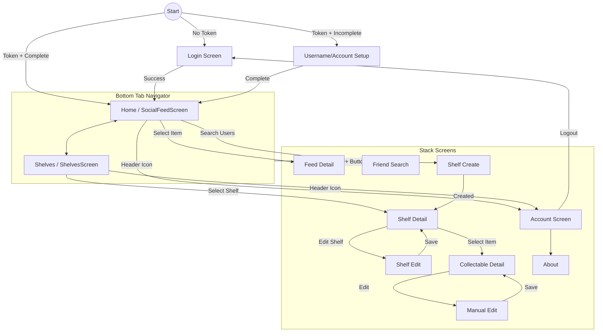

# Mobile Application Screen Flow

This document outlines the navigation flow of the ShelvesAI mobile application.

## Overview

The application uses a Hybrid navigation strategy:
1.  **Bottom Tab Navigator**: The main interface for switching between major contexts (Home, Add, Shelves).
2.  **Native Stack Navigator**: Handles specific flows and detailed views pushed on top of the tabs.

## Navigation Structure

### 1. Startup & Authentication
- **LoginScreen**: Initial screen if no user token is found.
- **UsernameSetupScreen**: Shown after login if the user profile is incomplete.
- **AccountScreen**: Shown during onboarding to complete profile.

### 2. Main Navigation (Bottom Tabs)
Once authenticated, the user lands on the **Main** navigator which contains:

| Tab Name | Icon | Screen Component | Description |
| :--- | :--- | :--- | :--- |
| **Home** | `home` | `SocialFeedScreen` | The landing screen showing activity feed. |
| **Add** | `add` | `ShelfCreateScreen` | (Button) Opens the "New Shelf" screen directly (Modal-like behavior). |
| **Shelves** | `library` | `ShelvesScreen` | Users' personal collection of shelves. |

*Note: The "Add" tab is a custom button that intercepts the press to navigate to `ShelfCreateScreen` instead of switching tabs.*

### 3. Stack Screens (Global)
These screens can be accessed from multiple points in the app and overlay the current context:

*   **FeedDetail**: Detailed view of a feed item.
*   **FriendSearch**: Search for other users.
*   **ShelfCreate**: Screen to create a new shelf.
*   **ShelfDetail**: View contents of a specific shelf.
*   **ShelfEdit**: Modify shelf settings.
*   **CollectableDetail**: View details of an item in a shelf.
*   **ManualEdit**: Manually edit item metadata.
*   **Account**: User settings and profile management.
*   **About**: App information.

## Visual Flow Diagram

## Detailed Interaction Map

### From Home (Feed)
- **Tap Feed Item** -> `FeedDetail`
- **Tap Profile Icon (Header)** -> `Account`

### From Shelves
- **Tap Shelf Card** -> `ShelfDetail`
- **Tap Profile Icon (Header)** -> `Account`

### From Global Add Button (Center Tab)
- **Tap (+)** -> `ShelfCreateScreen`

### From Details
- **ShelfDetail**
  - Tap Item -> `CollectableDetail`
  - Tap Options/Edit -> `ShelfEdit`
- **CollectableDetail**
  - Tap Edit -> `ManualEdit`
