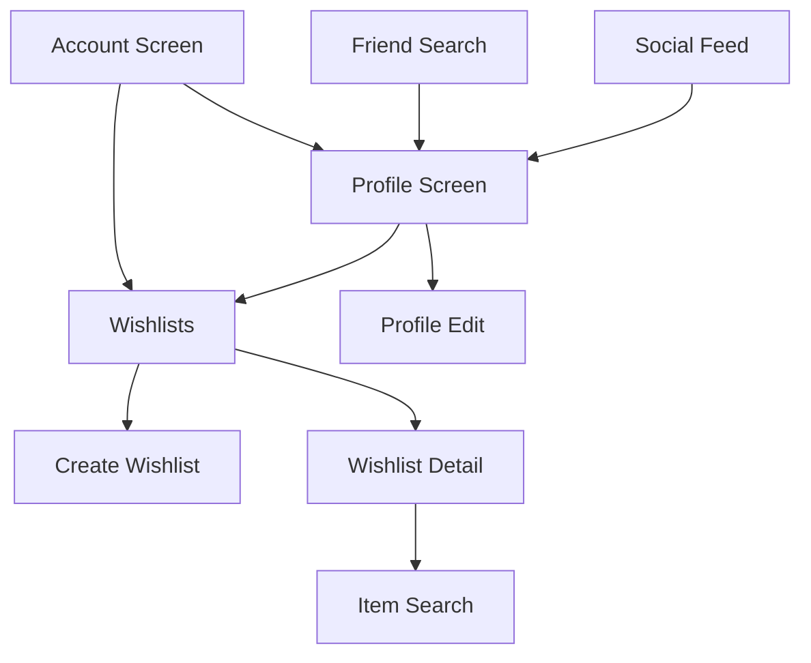

# Task 06: Navigation Integration

## Objective
Wire up profile and wishlist screens into app navigation.

## Files to Modify

### 1. [MODIFY] `mobile/src/App.js`
Add to stack navigator:
```javascript
<Stack.Screen name="Profile" component={ProfileScreen} />
<Stack.Screen name="ProfileEdit" component={ProfileEditScreen} />
<Stack.Screen name="Wishlists" component={WishlistsScreen} />
<Stack.Screen name="Wishlist" component={WishlistScreen} />
<Stack.Screen name="WishlistCreate" component={WishlistCreateScreen} />
```

### 2. [MODIFY] `mobile/src/screens/SocialFeedScreen.js`
Make username/avatar tappable:
```javascript
onPress={() => navigation.navigate('Profile', { username: item.username })}
```

### 3. [MODIFY] `mobile/src/screens/FriendSearchScreen.js`
Make search results tappable:
```javascript
onPress={() => navigation.navigate('Profile', { username: user.username })}
```

### 4. [MODIFY] `mobile/src/screens/AccountScreen.js`
Add navigation options:
- "View My Profile" → ProfileScreen (own)
- "My Wishlists" → WishlistsScreen

### 5. [MODIFY] `mobile/src/screens/CollectableDetailScreen.js`
Add action:
- "Add to Wishlist" → shows wishlist picker modal

## Navigation Flow Update



## Verification
- [ ] Can navigate to profile from feed
- [ ] Can navigate to profile from friend search
- [ ] Can access wishlists from account
- [ ] Back navigation works correctly
