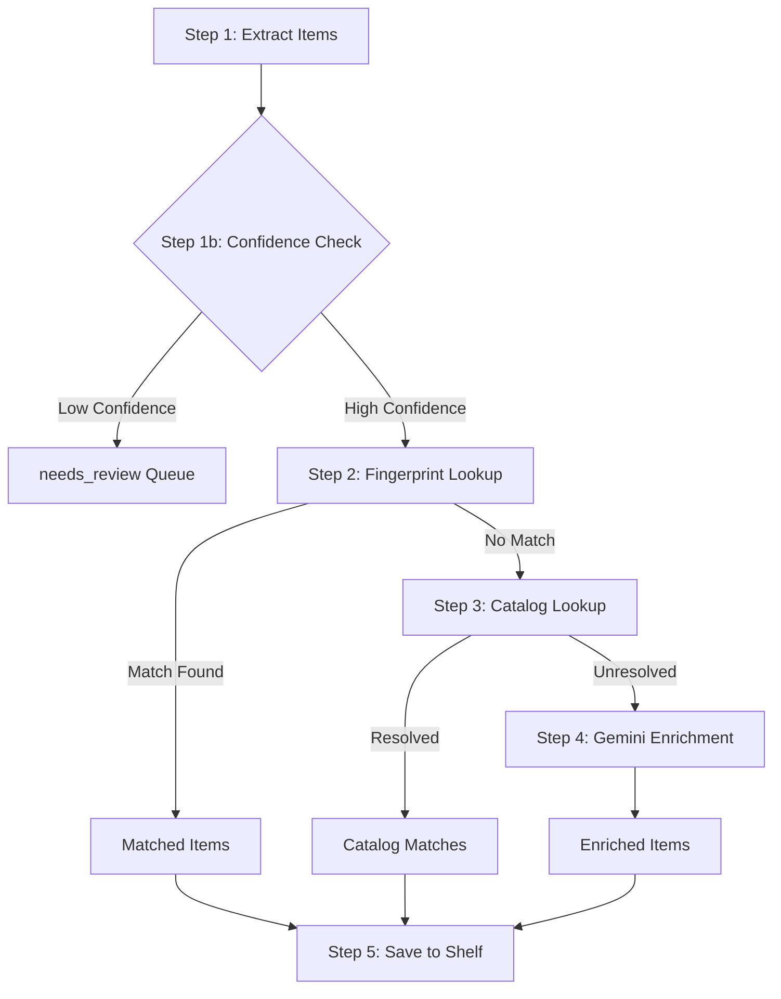

# Vision Pipeline Workflow

This document outlines the processing workflow for the shelf vision feature, which takes an image of items on a shelf and identifies/catalogs them.

## Entry Point
`VisionPipelineService.processImage(imageBase64, shelf, userId)`

Located in: [visionPipeline.js](file:///c:/Users/johna/Documents/Projects/ShelvesAI/api/services/visionPipeline.js)

---

## Workflow Steps



### Step 1: Extract Items (Gemini Vision)
- **Service**: `GoogleGeminiService.detectShelfItemsFromImage()`
- **Input**: Base64 image, shelf type
- **Output**: Array of detected items with title, author, confidence scores

### Step 1b: Tiered Confidence Categorization
- **Thresholds**: `VISION_CONFIDENCE_MAX` (default: 0.92), `VISION_CONFIDENCE_MIN` (default: 0.85)
- **High confidence (≥ 0.92)** → Standard workflow (fingerprint → catalog → enrichment)
- **Medium confidence (0.85 - 0.92)** → Fingerprint lookup only → special "uncertain" enrichment (skips catalog APIs)
- **Low confidence (< 0.85)** → Sent directly to `needs_review` queue

### Step 2: Fingerprint Lookup (PostgreSQL)
- **Service**: `matchCollectable()` → hash-based lookups only
- **Lookup Order**:
  1. `fingerprint` column (exact hash from catalog/enrichment data)
  2. `lightweight_fingerprint` column (title + creator hash)
  3. `fuzzy_fingerprints` array (raw OCR hashes from previous enrichments)
- **Purpose**: Check if item already exists in local database via fast hash lookups
- **Match found** → Item is ready for shelf (skip catalog/enrichment)
- **No match** → Continue to Step 3

### Step 3: Catalog Lookup (External APIs)
- **Service**: `BookCatalogService.lookupFirstPass()` (or Game/Movie variants)
- **Routing**: When `USE_CATALOG_ROUTER=true`, uses [CatalogRouter](file:///c:/Users/johna/Documents/Projects/ShelvesAI/api/services/catalog/CatalogRouter.js) for config-driven API priority
- **Default API Order** (Books):
  1. Hardcover (if configured)
  2. OpenLibrary (fallback)
- **Purpose**: Enrich item with metadata from external catalogs
- **Resolved** → Item is ready for shelf
- **Unresolved** → Continue to Step 4

### Step 4: Gemini Enrichment (Conditional)
- **Service**: `GoogleGeminiService.enrichWithSchema()`
- **Condition**: Only runs if BOTH fingerprint AND catalog failed
- **Purpose**: Last-resort AI enrichment for unknown items
- **Fuzzy Fingerprint**: When enrichment succeeds, the raw OCR hash is stored in `fuzzy_fingerprints` array so future scans with the same "bad" spelling can match directly

### Step 5: Save to Shelf
- **Service**: `saveToShelf()` → `shelvesQueries.addCollectable()`
- **Actions**:
  - Upsert collectable to database
  - Link collectable to user's shelf
  - Any post-enrichment low-confidence items → `needs_review` queue

---

## Key Files

| File | Purpose |
|------|---------|
| [visionPipeline.js](file:///c:/Users/johna/Documents/Projects/ShelvesAI/api/services/visionPipeline.js) | Main workflow orchestration |
| [googleGemini.js](file:///c:/Users/johna/Documents/Projects/ShelvesAI/api/services/googleGemini.js) | Vision detection + AI enrichment |
| [BookCatalogService.js](file:///c:/Users/johna/Documents/Projects/ShelvesAI/api/services/catalog/BookCatalogService.js) | Book catalog lookups |
| [CatalogRouter.js](file:///c:/Users/johna/Documents/Projects/ShelvesAI/api/services/catalog/CatalogRouter.js) | Config-driven API routing |
| [apiContainers.json](file:///c:/Users/johna/Documents/Projects/ShelvesAI/api/config/apiContainers.json) | API priority configuration |
| [collectables.js](file:///c:/Users/johna/Documents/Projects/ShelvesAI/api/database/queries/collectables.js) | Fingerprint + fuzzy matching queries |

## Configuration

| Env Variable | Default | Purpose |
|--------------|---------|---------|
| `VISION_CONFIDENCE_MAX` | `0.92` | High confidence threshold |
| `VISION_CONFIDENCE_MIN` | `0.85` | Medium confidence threshold |
| `USE_CATALOG_ROUTER` | `false` | Enable config-driven API routing |
| `DISABLE_HARDCOVER` | `false` | Skip Hardcover API (env override) |
| `DISABLE_OPENLIBRARY` | `false` | Skip OpenLibrary API (env override) |

---

## Config-Driven API Routing

When `USE_CATALOG_ROUTER=true`, catalog lookups use [apiContainers.json](file:///c:/Users/johna/Documents/Projects/ShelvesAI/api/config/apiContainers.json) to determine API priority:

```json
{
  "books": {
    "mode": "fallback",
    "apis": [
      { "name": "hardcover", "enabled": true, "priority": 1, "envDisableKey": "DISABLE_HARDCOVER" },
      { "name": "openLibrary", "enabled": true, "priority": 2, "envDisableKey": "DISABLE_OPENLIBRARY" }
    ]
  }
}
```

**Modes:**
- `fallback` - Stop on first successful result
- `merge` - Call all APIs in parallel, combine results

**Adding New APIs:**
1. Create adapter in `api/services/catalog/adapters/`
2. Register in [CatalogRouter.js](file:///c:/Users/johna/Documents/Projects/ShelvesAI/api/services/catalog/CatalogRouter.js)
3. Add to container config in [apiContainers.json](file:///c:/Users/johna/Documents/Projects/ShelvesAI/api/config/apiContainers.json)
