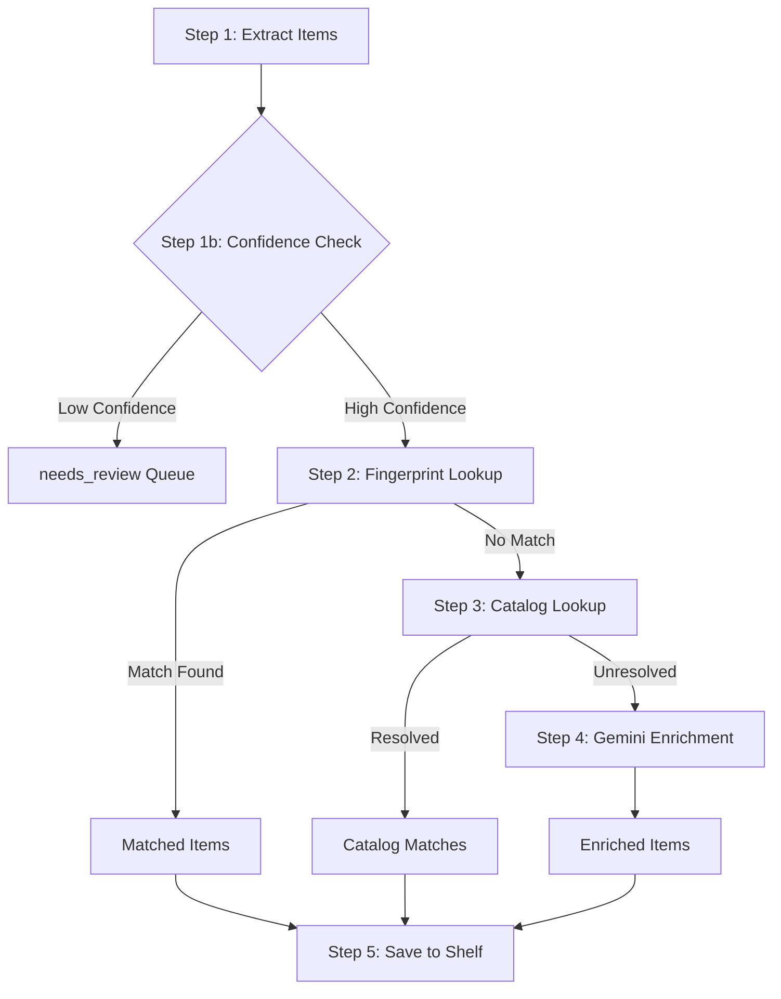
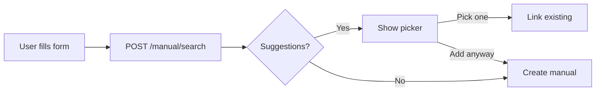
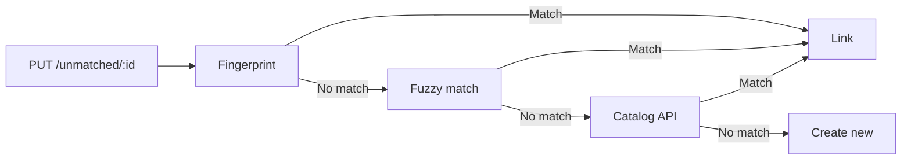

# Vision Pipeline Workflow

This document outlines the processing workflow for the shelf vision feature, which takes an image of items on a shelf and identifies/catalogs them.

## Entry Point
`VisionPipelineService.processImage(imageBase64, shelf, userId)`

Located in: [visionPipeline.js](file:///c:/Users/johna/Documents/Projects/ShelvesAI/api/services/visionPipeline.js)

---

## Workflow Steps



### Step 1: Extract Items (Gemini Vision)
- **Service**: `GoogleGeminiService.detectShelfItemsFromImage()`
- **Input**: Base64 image, shelf type
- **Output**: Array of detected items with title, author, confidence scores

### Step 1b: Tiered Confidence Categorization
- **Thresholds**: `VISION_CONFIDENCE_MAX` (default: 0.92), `VISION_CONFIDENCE_MIN` (default: 0.85)
- **High confidence (≥ 0.92)** → Standard workflow (fingerprint → catalog → enrichment)
- **Medium confidence (0.85 - 0.92)** → Fingerprint lookup only → special "uncertain" enrichment (skips catalog APIs)
- **Low confidence (< 0.85)** → Sent directly to `needs_review` queue

### Step 2: Fingerprint Lookup (PostgreSQL)
- **Service**: `matchCollectable()` → hash-based lookups only
- **Lookup Order**:
  1. `fingerprint` column (exact hash from catalog/enrichment data)
  2. `lightweight_fingerprint` column (title + creator hash)
  3. `fuzzy_fingerprints` array (raw OCR hashes from previous enrichments)
- **Purpose**: Check if item already exists in local database via fast hash lookups
- **Match found** → Item is ready for shelf (skip catalog/enrichment)
- **No match** → Continue to Step 3

### Step 3: Catalog Lookup (External APIs)
- **Service**: `BookCatalogService.lookupFirstPass()` (or Game/Movie variants)
- **Routing**: When `USE_CATALOG_ROUTER=true`, uses [CatalogRouter](file:///c:/Users/johna/Documents/Projects/ShelvesAI/api/services/catalog/CatalogRouter.js) for config-driven API priority
- **Default API Order** (Books):
  1. Hardcover (if configured)
  2. OpenLibrary (fallback)
- **Purpose**: Enrich item with metadata from external catalogs
- **Resolved** → Item is ready for shelf
- **Unresolved** → Continue to Step 4

### Step 4: Gemini Enrichment (Conditional)
- **Service**: `GoogleGeminiService.enrichWithSchema()`
- **Condition**: Only runs if BOTH fingerprint AND catalog failed
- **Purpose**: Last-resort AI enrichment for unknown items
- **Fuzzy Fingerprint**: When enrichment succeeds, the raw OCR hash is stored in `fuzzy_fingerprints` array so future scans with the same "bad" spelling can match directly

### Step 5: Save to Shelf
- **Service**: `saveToShelf()` → `shelvesQueries.addCollectable()`
- **Actions**:
  - Upsert collectable to database
  - Link collectable to user's shelf
  - Any post-enrichment low-confidence items → `needs_review` queue

---

## Key Files

| File | Purpose |
|------|---------|
| [visionPipeline.js](file:///c:/Users/johna/Documents/Projects/ShelvesAI/api/services/visionPipeline.js) | Main workflow orchestration |
| [googleGemini.js](file:///c:/Users/johna/Documents/Projects/ShelvesAI/api/services/googleGemini.js) | Vision detection + AI enrichment |
| [BookCatalogService.js](file:///c:/Users/johna/Documents/Projects/ShelvesAI/api/services/catalog/BookCatalogService.js) | Book catalog lookups |
| [CatalogRouter.js](file:///c:/Users/johna/Documents/Projects/ShelvesAI/api/services/catalog/CatalogRouter.js) | Config-driven API routing |
| [apiContainers.json](file:///c:/Users/johna/Documents/Projects/ShelvesAI/api/config/apiContainers.json) | API priority configuration |
| [visionSettings.json](file:///c:/Users/johna/Documents/Projects/ShelvesAI/api/config/visionSettings.json) | Per-type prompts & confidence thresholds |
| [collectables.js](file:///c:/Users/johna/Documents/Projects/ShelvesAI/api/database/queries/collectables.js) | Fingerprint + fuzzy matching queries |

## Configuration

### Environment Variables
| Env Variable | Default | Purpose |
|--------------|---------|------------|
| `VISION_CONFIDENCE_MAX` | `0.92` | Default high confidence threshold (fallback) |
| `VISION_CONFIDENCE_MIN` | `0.85` | Default medium confidence threshold (fallback) |
| `USE_CATALOG_ROUTER` | `false` | Enable config-driven API routing |
| `DISABLE_HARDCOVER` | `false` | Skip Hardcover API (env override) |
| `DISABLE_OPENLIBRARY` | `false` | Skip OpenLibrary API (env override) |

### Per-Type Vision Settings

Configured in [visionSettings.json](file:///c:/Users/johna/Documents/Projects/ShelvesAI/api/config/visionSettings.json):

| Type | Max Threshold | Min Threshold | Notes |
|------|---------------|---------------|-------|
| `book` | 0.92 | 0.85 | Standard - author usually visible on spine |
| `movie` | 0.80 | 0.70 | Lower - director rarely on Blu-ray spines |
| `game` | 0.85 | 0.75 | Lower - publisher sometimes visible |
| `vinyl` | 0.85 | 0.75 | Standard - artist usually visible |

Each type also has a custom prompt that tells Gemini what metadata to expect (e.g., movies prompt explicitly states directors are rarely visible).

---

## Config-Driven API Routing

When `USE_CATALOG_ROUTER=true`, catalog lookups use [apiContainers.json](file:///c:/Users/johna/Documents/Projects/ShelvesAI/api/config/apiContainers.json) to determine API priority:

```json
{
  "books": {
    "mode": "fallback",
    "apis": [
      { "name": "hardcover", "enabled": true, "priority": 1, "envDisableKey": "DISABLE_HARDCOVER" },
      { "name": "openLibrary", "enabled": true, "priority": 2, "envDisableKey": "DISABLE_OPENLIBRARY" }
    ]
  }
}
```

**Modes:**
- `fallback` - Stop on first successful result
- `merge` - Call all APIs in parallel, combine results

**Adding New APIs:**
1. Create adapter in `api/services/catalog/adapters/`
2. Register in [CatalogRouter.js](file:///c:/Users/johna/Documents/Projects/ShelvesAI/api/services/catalog/CatalogRouter.js)
3. Add to container config in [apiContainers.json](file:///c:/Users/johna/Documents/Projects/ShelvesAI/api/config/apiContainers.json)

---

## Activity Feed Aggregation + Social

This project now batches item-level feed events into time-window aggregates and exposes likes/comments on those aggregates.

### Overview
- **Item events** still write to `event_logs`.
- **Aggregates** live in `event_aggregates` and are keyed by `(user_id, shelf_id, event_type)` with a fixed window.
- **Social metadata** (likes, comments) references aggregates, not individual events.

### Aggregation Workflow
1. `logEvent()` selects or creates an **open aggregate** for the user/shelf/type.
2. The new event is inserted into `event_logs` with `aggregate_id`.
3. The aggregate updates:
   - `item_count`
   - `last_activity_at`
   - `preview_payloads` (capped)

**Window logic:**
- Window starts at first event time and closes after `FEED_AGGREGATE_WINDOW_MINUTES`.
- New events within the window attach to the same aggregate.
- Events outside the window create a new aggregate.

### Feed Read Path
- `/api/feed` reads from `event_aggregates` (not `event_logs`).
- `preview_payloads` drive the feed card preview list.
- Social counts and `hasLiked` are attached per aggregate.
- `/api/feed/:id` accepts **aggregate IDs** and returns all events in that aggregate (with title resolution from DB when payloads are missing).

### Social Endpoints
- `POST /api/feed/:eventId/like`
- `POST /api/feed/:eventId/comments`
- `GET /api/feed/:eventId/comments`
- `DELETE /api/feed/:eventId/comments/:commentId`

### Client Behavior
- Feed list hides `shelf.created` entries (client-side).
- Friends/Discover exclude the viewer's own events, while All includes them.
- `readOnly` shelves hide edit/add actions in the UI.

### Key Files
| File | Purpose |
|------|---------|
| [feed.js](file:///c:/Users/johna/Documents/Projects/ShelvesAI/api/database/queries/feed.js) | Aggregate lookup + event logging |
| [eventSocial.js](file:///c:/Users/johna/Documents/Projects/ShelvesAI/api/database/queries/eventSocial.js) | Likes/comments queries |
| [feedController.js](file:///c:/Users/johna/Documents/Projects/ShelvesAI/api/controllers/feedController.js) | Feed list + aggregate detail |
| [eventSocialController.js](file:///c:/Users/johna/Documents/Projects/ShelvesAI/api/controllers/eventSocialController.js) | Social endpoints |
| [SocialFeedScreen.js](file:///c:/Users/johna/Documents/Projects/ShelvesAI/mobile/src/screens/SocialFeedScreen.js) | Feed list UI + filtering |
| [FeedDetailScreen.js](file:///c:/Users/johna/Documents/Projects/ShelvesAI/mobile/src/screens/FeedDetailScreen.js) | Aggregate detail + likes/comments |

### Backfill Scripts
- `node api/scripts/backfill-event-aggregates.js`
- `node api/scripts/backfill-event-payloads.js`

### Feed Config
| Env Variable | Default | Purpose |
|--------------|---------|------------|
| `FEED_AGGREGATE_WINDOW_MINUTES` | `15` | Time window for aggregates |
| `FEED_AGGREGATE_PREVIEW_LIMIT` | `5` | Preview payload cap per aggregate |

---

## Manual Add & Needs Review Deduplication

Both manual add and needs_review flows now use a centralized [CollectableMatchingService](file:///c:/Users/johna/Documents/Projects/ShelvesAI/api/services/collectableMatchingService.js) to prevent database duplicates.

### Manual Add (2-Step Flow)



**Endpoint:** `POST /api/shelves/:shelfId/manual/search`

Searches database and external APIs, returns suggestions for user to choose from.

### Needs Review Completion



**Matching order:**
1. Lightweight fingerprint (exact hash)
2. Fuzzy match (pg_trgm similarity)
3. Catalog API lookup
4. Create new collectable

### Key Files

| File | Purpose |
|------|---------|
| [collectableMatchingService.js](file:///c:/Users/johna/Documents/Projects/ShelvesAI/api/services/collectableMatchingService.js) | Centralized fingerprint + API matching |
| [shelvesController.js](file:///c:/Users/johna/Documents/Projects/ShelvesAI/api/controllers/shelvesController.js) | `searchManualEntry` for /manual/search |
| [unmatched.js](file:///c:/Users/johna/Documents/Projects/ShelvesAI/api/routes/unmatched.js) | PUT /:id with API fallback |
