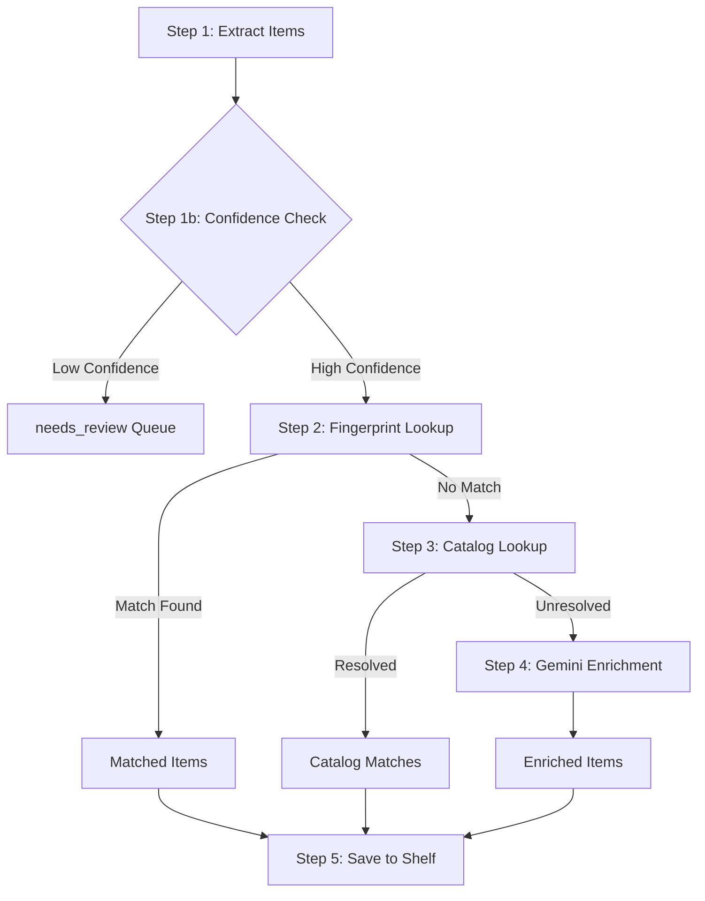

# Vision Pipeline Workflow

This document outlines the processing workflow for the shelf vision feature, which takes an image of items on a shelf and identifies/catalogs them.

## Entry Point
`VisionPipelineService.processImage(imageBase64, shelf, userId)`

Located in: [visionPipeline.js](file:///c:/Users/johna/Documents/Projects/ShelvesAI/api/services/visionPipeline.js)

---

## Workflow Steps

### Step 1: Extract Items (Gemini Vision)
- **Service**: `GoogleGeminiService.detectShelfItemsFromImage()`
- **Input**: Base64 image, shelf type
- **Output**: Array of detected items with title, author, confidence scores

### Step 1b: Early Confidence Categorization
- **Threshold**: `VISION_AUTO_ADD_THRESHOLD` (default: 0.9)
- **Low confidence items** → Sent directly to `needs_review` queue
- **High confidence items** → Continue to Step 2

### Step 2: Fingerprint Lookup (PostgreSQL)
- **Service**: `matchCollectable()` → `collectablesQueries.findByLightweightFingerprint()` + `fuzzyMatch()`
- **Purpose**: Check if item already exists in local database
- **Match found** → Item is ready for shelf (skip catalog/enrichment)
- **No match** → Continue to Step 3

### Step 3: Catalog Lookup (External APIs)
- **Service**: `BookCatalogService.lookupFirstPass()` (or Game/Movie variants)
- **APIs Called**: 
  1. OpenLibrary
  2. Hardcover (fallback)
- **Purpose**: Enrich item with metadata from external catalogs
- **Resolved** → Item is ready for shelf
- **Unresolved** → Continue to Step 4

### Step 4: Gemini Enrichment (Conditional)
- **Service**: `GoogleGeminiService.enrichWithSchema()`
- **Condition**: Only runs if BOTH fingerprint AND catalog failed
- **Purpose**: Last-resort AI enrichment for unknown items

### Step 5: Save to Shelf
- **Service**: `saveToShelf()` → `shelvesQueries.addCollectable()`
- **Actions**:
  - Upsert collectable to database
  - Link collectable to user's shelf
  - Any post-enrichment low-confidence items → `needs_review` queue

---

## Key Files

| File | Purpose |
|------|---------|
| [visionPipeline.js](file:///c:/Users/johna/Documents/Projects/ShelvesAI/api/services/visionPipeline.js) | Main workflow orchestration |
| [googleGemini.js](file:///c:/Users/johna/Documents/Projects/ShelvesAI/api/services/googleGemini.js) | Vision detection + AI enrichment |
| [BookCatalogService.js](file:///c:/Users/johna/Documents/Projects/ShelvesAI/api/services/catalog/BookCatalogService.js) | OpenLibrary/Hardcover lookups |
| [collectables.js](file:///c:/Users/johna/Documents/Projects/ShelvesAI/api/database/queries/collectables.js) | Fingerprint + fuzzy matching queries |

## Configuration

| Env Variable | Default | Purpose |
|--------------|---------|---------|
| `VISION_AUTO_ADD_THRESHOLD` | `0.9` | Confidence threshold for auto-add vs needs_review |
