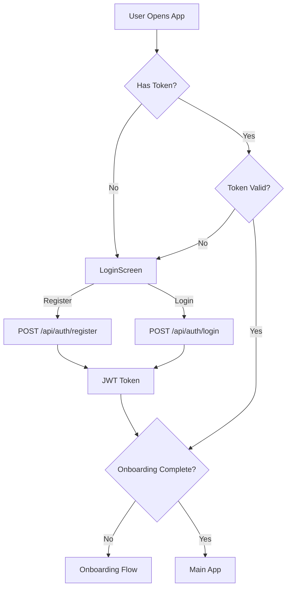
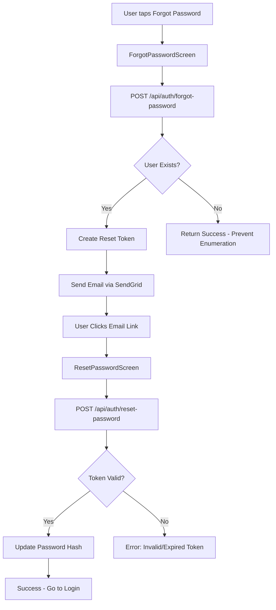
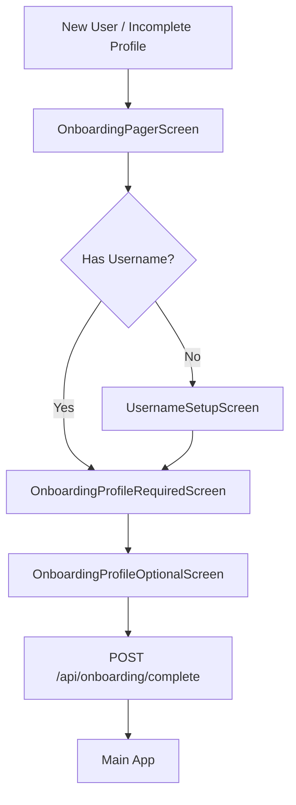

# Authentication & Onboarding Workflow

This document outlines the authentication system, password reset flow, and user onboarding process.

## Overview

ShelvesAI uses JWT-based authentication with bcrypt password hashing. New users go through a multi-step onboarding flow before accessing the main app.

---

## Authentication Flow



### Entry Points

| Endpoint | Method | Auth | Purpose |
|----------|--------|------|---------|
| `/api/auth/register` | POST | No | Create new account |
| `/api/auth/login` | POST | No | Authenticate existing user |
| `/api/auth/me` | GET | Yes | Get current user info |
| `/api/auth/username` | POST | Yes | Set/change username |

### Key Files
- **Routes**: `api/routes/auth.js`
- **Controller**: `api/controllers/authController.js`
- **Queries**: `api/database/queries/auth.js`
- **Middleware**: `api/middleware/auth.js`
- **Mobile Screen**: `mobile/src/screens/LoginScreen.js`

### Registration Flow
1. Client sends `{ username, email, password }`
2. Email validated and normalized to lowercase
3. Username converted to lowercase
4. Password hashed with bcrypt (10 rounds)
5. User record created in `users` table
6. JWT token generated (7-day expiration)
7. Returns `{ user, token, onboardingCompleted: false }`

### Constraints
- **Email**: `UNIQUE NOT NULL` - enforced by migration `20260125000000_add_unique_email_constraint.js`
- **Username**: `UNIQUE` (nullable initially)
- Duplicate email returns: `400 "Email taken"`
- Duplicate username returns: `400 "Username taken"`

---

## Password Reset Flow



### Endpoints

| Endpoint | Method | Auth | Purpose |
|----------|--------|------|---------|
| `/api/auth/forgot-password` | POST | No | Request password reset email |
| `/api/auth/reset-password` | POST | No | Reset password with token |
| `/api/auth/validate-reset-token` | GET | No | Validate token before reset |

### Key Files
- **Queries**: `api/database/queries/passwordReset.js`
- **Email Service**: `api/services/emailService.js`
- **Migration**: `api/database/migrations/20260125000001_create_password_reset_tokens.js`
- **Mobile Screens**:
  - `mobile/src/screens/ForgotPasswordScreen.js`
  - `mobile/src/screens/ResetPasswordScreen.js`

### Password Reset Tokens Table
```sql
CREATE TABLE password_reset_tokens (
    id SERIAL PRIMARY KEY,
    user_id UUID NOT NULL REFERENCES users(id) ON DELETE CASCADE,
    token TEXT NOT NULL UNIQUE,
    expires_at TIMESTAMPTZ NOT NULL,  -- 1 hour from creation
    used_at TIMESTAMPTZ,              -- Marked when used
    created_at TIMESTAMPTZ DEFAULT NOW()
);
```

### Security Features
- Tokens expire after 1 hour
- Tokens invalidated after single use
- Previous tokens invalidated when new one is requested
- Generic response prevents email enumeration attacks
- Secure random 64-character hex tokens

### Environment Variables
```env
SENDGRID_API_KEY=SG.your-sendgrid-api-key
SENDGRID_FROM_EMAIL=noreply@shelvesai.com
APP_NAME=ShelvesAI
APP_URL=https://shelvesai.com
```

---

## Onboarding Flow



### Onboarding Screens

| Screen | Purpose | Required Fields |
|--------|---------|-----------------|
| OnboardingPagerScreen | Intro carousel | None (view only) |
| UsernameSetupScreen | Set username | username (min 3 chars) |
| OnboardingProfileRequiredScreen | Core profile | email, firstName, city, state |
| OnboardingProfileOptionalScreen | Extras | None (photo, bio optional) |

### Intro Pages (OnboardingPagerScreen)

Configured in `api/config/onboardingScreen.json`:

1. **Meet ShelvesAI** (sparkles icon)
   - "Your collections, alive and social"

2. **Discover & Connect** (people icon)
   - "Follow collectors like you"

3. **Checking In** (chatbubble-ellipses icon)
   - "Share what you're into"
   - "Tell friends and the world what you're watching, reading, or playing right now."

4. **Organize Faster** (camera icon)
   - "Capture items in seconds"

### Key Files
- **Config**: `api/config/onboardingScreen.json`
- **Controller**: `api/controllers/onboardingController.js`
- **Routes**: `api/routes/onboarding.js`
- **Mobile Screens**: `mobile/src/screens/Onboarding*.js`

### Onboarding Detection (App.js)

The app checks onboarding status on mount:
```javascript
const missingRequired = !user?.email || !user?.firstName || !user?.city || !user?.state;
const onboardingCompleted = !!user?.onboardingCompleted;
setNeedsOnboarding(!onboardingCompleted || missingRequired);
```

### Completion Validation

`POST /api/onboarding/complete` validates:
- `email` exists
- `first_name` exists
- `city` exists
- `state` exists

Returns `400` with `missingFields` array if incomplete.

---

## Database Schema

### Users Table
```sql
CREATE TABLE users (
    id UUID PRIMARY KEY DEFAULT uuid_generate_v4(),
    username TEXT UNIQUE,
    email TEXT UNIQUE NOT NULL,
    password_hash TEXT NOT NULL,

    -- Profile fields
    first_name TEXT,
    last_name TEXT,
    phone_number TEXT,
    picture TEXT,

    -- Location
    country TEXT,
    state TEXT,
    city TEXT,

    -- Flags
    is_private BOOLEAN DEFAULT FALSE,
    is_premium BOOLEAN DEFAULT FALSE,
    onboarding_completed BOOLEAN DEFAULT FALSE,

    created_at TIMESTAMPTZ DEFAULT NOW(),
    updated_at TIMESTAMPTZ DEFAULT NOW()
);
```

### Indexes
- `idx_users_email` - Fast email lookups
- `idx_users_username` - Conditional index (non-null only)

---

## JWT Token Structure

```javascript
{
  id: user.id,        // UUID
  username: user.username,
  iat: <issued_at>,
  exp: <expires_at>   // 7 days from issue
}
```

### Token Validation Middleware
- `auth()` - Requires valid token, returns 401 if missing/invalid
- `optionalAuth()` - Continues with `req.user = null` if no token

---

## Mobile Navigation

### Auth Stack (!token)
```
LoginScreen
├── ForgotPasswordScreen
└── ResetPasswordScreen
```

### Onboarding Stack (token + needsOnboarding)
```
OnboardingPagerScreen (intro carousel)
├── UsernameSetupScreen
├── OnboardingProfileRequiredScreen
└── OnboardingProfileOptionalScreen
```

### Main Stack (authenticated)
```
BottomTabNavigator
└── ... (all other screens)
```

---

## Migrations

| Migration | Purpose |
|-----------|---------|
| `20260113000000_add_onboarding_completed.js` | Adds onboarding flag, backfills existing users |
| `20260125000000_add_unique_email_constraint.js` | Enforces email uniqueness |
| `20260125000001_create_password_reset_tokens.js` | Password reset tokens table |

---

## Testing Password Reset

1. Ensure SendGrid is configured in `.env`
2. Register a user with valid email
3. Tap "Forgot password?" on login screen
4. Enter email address
5. Check email for reset link
6. Enter new password
7. Login with new credentials

**Without SendGrid configured**: The email service logs the token to console for testing:
```
[EmailService] Would send reset email to user@example.com with token: abc123...
```
