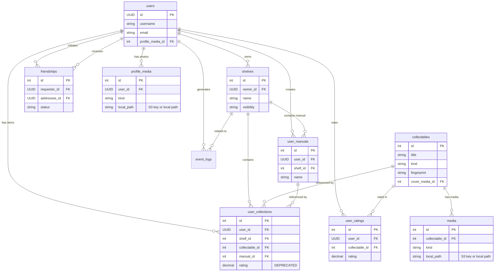

# Backend Database Structure

This document outlines the PostgreSQL database structure for ShelvesAI.

## Overview

The database uses PostgreSQL with the following extensions:
- `uuid-ossp`: For UUID generation.
- `pg_trgm`: For fuzzy text search (trigrams).

## Tables

### 1. **users**
Stores user account information and profile details.

| Column | Type | Constraints | Description |
| :--- | :--- | :--- | :--- |
| **id** | UUID | `PK`, `DEFAULT uuid_generate_v4()` | Unique user identifier |
| username | TEXT | `UNIQUE` | Unique handle |
| email | TEXT | `UNIQUE`, `NOT NULL` | User email address |
| password_hash | TEXT | `NOT NULL` | Hashed password |
| first_name | TEXT | | First name |
| last_name | TEXT | | Last name |
| phone_number | TEXT | | Phone number |
| picture | TEXT | | Profile picture URL |
| country | TEXT | | Location: Country |
| state | TEXT | | Location: State |
| city | TEXT | | Location: City |
| is_private | BOOLEAN | `DEFAULT FALSE` | Privacy setting |
| is_premium | BOOLEAN | `DEFAULT FALSE` | Premium access flag |
| bio | TEXT | | Profile bio |
| profile_media_id | INTEGER | `FK -> profile_media(id)` | Linked profile media |
| onboarding_completed | BOOLEAN | `DEFAULT FALSE` | Onboarding gate |
| is_admin | BOOLEAN | `DEFAULT FALSE` | Admin privileges |
| is_suspended | BOOLEAN | `DEFAULT FALSE` | Suspension flag |
| suspended_at | TIMESTAMPTZ | | Suspension timestamp |
| suspension_reason | TEXT | | Suspension reason |
| created_at | TIMESTAMPTZ | `DEFAULT NOW()` | Creation timestamp |
| updated_at | TIMESTAMPTZ | `DEFAULT NOW()` | Last update timestamp |

**Indexes:** `email`, `username`, partial `is_suspended = true`

---

### 2. **shelves**
Containers for collections of items.

| Column | Type | Constraints | Description |
| :--- | :--- | :--- | :--- |
| **id** | SERIAL | `PK` | Unique shelf ID |
| owner_id | UUID | `FK -> users(id)` | Owner of the shelf |
| name | TEXT | `NOT NULL` | Shelf display name |
| type | TEXT | `NOT NULL` | Type of items (book, movie, game, etc.) |
| description | TEXT | | Optional description |
| visibility | TEXT | `DEFAULT 'private'` | 'private', 'friends', 'public' |
| created_at | TIMESTAMPTZ | `DEFAULT NOW()` | Creation timestamp |
| updated_at | TIMESTAMPTZ | `DEFAULT NOW()` | Last update timestamp |

**Indexes:** `owner_id`, `visibility`, `type`

---

### 3. **collectables** (Global Catalog)
The trusted global catalog of items (movies, games, books, etc.).

| Column | Type | Constraints | Description |
| :--- | :--- | :--- | :--- |
| **id** | SERIAL | `PK` | Unique global item ID |
| fingerprint | TEXT | `UNIQUE` | Unique hash for deduplication |
| lightweight_fingerprint | TEXT | | Simpler hash for broad matching |
| kind | TEXT | `NOT NULL` | 'book', 'movie', 'game', 'album' |
| title | TEXT | `NOT NULL` | Title of the item |
| subtitle | TEXT | | Subtitle |
| description | TEXT | | Synopsis or description |
| primary_creator | TEXT | | Main author/director/developer |
| creators | TEXT[] | `DEFAULT {}` | List of creators |
| publishers | TEXT[] | `DEFAULT {}` | List of publishers |
| year | TEXT | | Release year |
| tags | TEXT[] | `DEFAULT {}` | Tags/keywords |
| genre | TEXT[] | `DEFAULT {}` | Genre list |
| runtime | INTEGER | | Runtime in minutes (movies/TV) |
| identifiers | JSONB | `DEFAULT {}` | ISBN, IMDB ID, IGDB ID, etc. |
| images | JSONB | `DEFAULT []` | Array of image URLs |
| cover_url | TEXT | | Primary cover image (legacy) |
| cover_image_url | TEXT | | Resolved cover URL or local path |
| cover_image_source | TEXT | | `'external'` (hot-linked) or `'local'` (cached) |
| cover_media_id | INTEGER | `FK -> media(id)` | Linked cached media entry |
| attribution | JSONB | | API compliance attribution data |
| sources | JSONB | `DEFAULT []` | Provenance metadata |
| external_id | TEXT | | Primary external ID reference |
| fuzzy_fingerprints | JSONB | `DEFAULT []` | For OCR matching |
| created_at | TIMESTAMPTZ | `DEFAULT NOW()` | Creation timestamp |
| updated_at | TIMESTAMPTZ | `DEFAULT NOW()` | Last update timestamp |

**Indexes:** `fingerprint`, `lightweight_fingerprint`, `kind`, `title` (trigram), `external_id`, `cover_media_id`

---

### 4. **media**
Cached media assets for collectables (covers, thumbnails, etc.). Supports both local filesystem and AWS S3 storage.

| Column | Type | Constraints | Description |
| :--- | :--- | :--- | :--- |
| **id** | SERIAL | `PK` | Unique media ID |
| collectable_id | INTEGER | `FK -> collectables(id)` | Owning collectable |
| kind | TEXT | `NOT NULL` | Media kind (cover, screenshot) |
| variant | TEXT | | Size/variant (small, medium, large) |
| provider | TEXT | | Source provider |
| source_url | TEXT | `NOT NULL` | Original source URL |
| local_path | TEXT | | S3 key or local path (e.g., `books/Oathbringer/sha1.jpg`) |
| content_type | TEXT | | MIME type |
| size_bytes | INTEGER | | Payload size |
| checksum | TEXT | | Content hash (sha1) |
| created_at | TIMESTAMPTZ | `DEFAULT NOW()` | Creation timestamp |
| updated_at | TIMESTAMPTZ | `DEFAULT NOW()` | Last update timestamp |

**Indexes:** `collectable_id`, `kind`, `collectable_id+source_url` (unique)

**Storage:** When S3 is configured, `local_path` stores the S3 object key. URL is resolved at runtime via `mediaUrl.js`:
- S3: `${S3_PUBLIC_URL}/${local_path}` (auto-adds `https://` if missing)
- Local: `/media/${local_path}` (client prepends API base)

**API Response:** Controllers use `resolveMediaUrl()` to add resolved URL fields:
- `coverMediaPath` (raw path) + `coverMediaUrl` (resolved URL)
- Mobile clients should prefer `coverMediaUrl` when available

---

### 4b. **profile_media**
Profile photos and avatars for users. Supports both local filesystem and AWS S3 storage.

| Column | Type | Constraints | Description |
| :--- | :--- | :--- | :--- |
| **id** | SERIAL | `PK` | Unique media ID |
| user_id | UUID | `FK -> users(id)` | Owning user |
| kind | TEXT | `DEFAULT 'avatar'` | Media kind (avatar) |
| source_url | TEXT | | Original source URL or filename |
| local_path | TEXT | | S3 key or local path (e.g., `profiles/{userId}/{hash}.jpg`) |
| content_type | TEXT | | MIME type |
| size_bytes | INTEGER | | Payload size |
| checksum | TEXT | | Content hash (sha256, first 16 chars) |
| created_at | TIMESTAMPTZ | `DEFAULT NOW()` | Creation timestamp |

**Indexes:** `user_id`

**Related:** `users.profile_media_id` references this table for the active profile photo.

---

### 5. **user_manuals**
Custom user-created items that don't exist in the global catalog.

| Column | Type | Constraints | Description |
| :--- | :--- | :--- | :--- |
| **id** | SERIAL | `PK` | Unique manual item ID |
| user_id | UUID | `FK -> users(id)` | Creator |
| shelf_id | INTEGER | `FK -> shelves(id)` | Associated shelf |
| name | TEXT | `NOT NULL` | Item name |
| type | TEXT | | Item type |
| description | TEXT | | Description |
| author | TEXT | | Author/Creator name |
| publisher | TEXT | | Publisher name |
| format | TEXT | | Physical/Digital format |
| year | TEXT | | Release year |
| genre | TEXT[] | `DEFAULT {}` | Genre list |
| tags | TEXT[] | `DEFAULT {}` | Tags |
| limited_edition | TEXT | | Numbered edition notation (e.g. "37/50") |
| item_specific_text | TEXT | | Unique text (store picks, inscriptions) |
| created_at | TIMESTAMPTZ | `DEFAULT NOW()` | Creation timestamp |

**Indexes:** `user_id`, `shelf_id`

---

### 6. **user_collections**
The join table linking items to shelves (the actual "instances" of items in a user's library).

| Column | Type | Constraints | Description |
| :--- | :--- | :--- | :--- |
| **id** | SERIAL | `PK` | Unique collection entry ID |
| user_id | UUID | `FK -> users(id)` | User who owns the item |
| shelf_id | INTEGER | `FK -> shelves(id)` | Shelf containing the item |
| collectable_id | INTEGER | `FK -> collectables(id)` | Link to catalog item (nullable) |
| manual_id | INTEGER | `FK -> user_manuals(id)` | Link to manual item (nullable) |
| position | INTEGER | | Sort order |
| format | TEXT | | Usage format (e.g. hardcover) |
| notes | TEXT | | User personal notes |
| rating | DECIMAL | 0.0 - 5.0 | User rating |
| created_at | TIMESTAMPTZ | `DEFAULT NOW()` | Added timestamp |

**Constraints:**
- Unique (`user_id`, `shelf_id`, `collectable_id`)
- Check: Must have either `collectable_id` OR `manual_id`, but not both/neither.

**Indexes:** `shelf_id`, `user_id`, `collectable_id`

---

### 7. **friendships**
Manages social connections between users.

| Column | Type | Constraints | Description |
| :--- | :--- | :--- | :--- |
| **id** | SERIAL | `PK` | Unique friendship ID |
| requester_id | UUID | `FK -> users(id)` | Initiator |
| addressee_id | UUID | `FK -> users(id)` | Target |
| status | TEXT | `DEFAULT 'pending'` | 'pending', 'accepted', 'blocked' |
| message | TEXT | | Request message |
| created_at | TIMESTAMPTZ | `DEFAULT NOW()` | Request timestamp |
| updated_at | TIMESTAMPTZ | `DEFAULT NOW()` | Status change timestamp |

**Constraints:**
- Unique (`requester_id`, `addressee_id`)
- Requester != Addressee

**Indexes:** `requester_id`, `addressee_id`, `status`, `(status, requester_id)`, `(status, addressee_id)`

---

### 8. **notifications**
User-facing notifications (likes, friend requests, etc.) with soft-delete support.

| Column | Type | Constraints | Description |
| :--- | :--- | :--- | :--- |
| **id** | UUID | `PK` | Unique notification ID |
| user_id | UUID | `FK -> users(id)` | Recipient |
| actor_id | UUID | `FK -> users(id)` | Actor (nullable) |
| type | TEXT | `NOT NULL` | Notification type |
| entity_id | TEXT | `NOT NULL` | Target entity identifier |
| entity_type | TEXT | `NOT NULL` | Target entity type |
| metadata | JSONB | `DEFAULT {}` | Notification payload |
| is_read | BOOLEAN | `DEFAULT FALSE` | Read flag |
| created_at | TIMESTAMPTZ | `DEFAULT NOW()` | Creation timestamp |
| deleted_at | TIMESTAMPTZ | | Soft-delete timestamp |

**Indexes:** `(user_id, is_read, created_at)`, `(user_id, created_at)`, partial `(user_id, is_read, created_at DESC) WHERE deleted_at IS NULL`, and partial unique dedup indexes for `like` and `friend_request`.

---

### 9. **event_logs**
Activity feed system.

| Column | Type | Constraints | Description |
| :--- | :--- | :--- | :--- |
| **id** | SERIAL | `PK` | Unique log ID |
| user_id | UUID | `FK -> users(id)` | Actor |
| shelf_id | INTEGER | `FK -> shelves(id)` | Related shelf (optional) |
| event_type | TEXT | `NOT NULL` | e.g., 'SHELF_CREATED', 'ITEM_ADDED' |
| payload | JSONB | `DEFAULT {}` | Event metadata |
| created_at | TIMESTAMPTZ | `DEFAULT NOW()` | Event timestamp |

**Indexes:** `user_id`, `shelf_id`, `event_type`, `created_at`

---

### 10. **event_aggregates**
Aggregated feed events for efficient feed display.

| Column | Type | Constraints | Description |
| :--- | :--- | :--- | :--- |
| **id** | UUID | `PK` | Unique aggregate ID |
| user_id | UUID | `FK -> users(id)` | Actor |
| shelf_id | INTEGER | `FK -> shelves(id)` | Related shelf (null for check-ins) |
| collectable_id | INTEGER | `FK -> collectables(id)` | For check-in events |
| event_type | TEXT | `NOT NULL` | e.g., 'item.collectable_added', 'checkin.activity' |
| checkin_status | TEXT | | 'starting', 'continuing', 'completed' |
| visibility | TEXT | `DEFAULT 'public'` | 'public' or 'friends' |
| note | TEXT | | Optional user message |
| item_count | INTEGER | `DEFAULT 0` | Number of items in aggregate |
| preview_payloads | JSONB | `DEFAULT []` | Preview data for feed display |
| window_start_utc | TIMESTAMPTZ | | Aggregation window start |
| window_end_utc | TIMESTAMPTZ | | Aggregation window end |
| last_activity_at | TIMESTAMPTZ | | Last update timestamp |
| created_at | TIMESTAMPTZ | `DEFAULT NOW()` | Creation timestamp |

**Indexes:** `user_id+shelf_id+event_type+window_end_utc`, `last_activity_at`, `collectable_id`

---

### 11. **user_ratings** (Proposed)
Decoupled user ratings for collectables. This table allows users to rate any collectable without requiring it to be on their shelf.

> **Note:** This table is planned to replace the `rating` column in `user_collections`. The current design couples ratings to shelf membership, preventing users from rating items they don't own (e.g., items on a friend's shelf).

| Column | Type | Constraints | Description |
| :--- | :--- | :--- | :--- |
| **id** | SERIAL | `PK` | Unique rating ID |
| user_id | UUID | `FK -> users(id)` | User who rated |
| collectable_id | INTEGER | `FK -> collectables(id)` | Rated item |
| rating | DECIMAL(2,1) | `CHECK (rating >= 0 AND rating <= 5)` | Rating value (0.0 - 5.0) |
| created_at | TIMESTAMPTZ | `DEFAULT NOW()` | Rating creation timestamp |
| updated_at | TIMESTAMPTZ | `DEFAULT NOW()` | Last update timestamp |

**Constraints:**
- Unique (`user_id`, `collectable_id`)

**Indexes:** `user_id`, `collectable_id`

**Migration Notes:**
- Existing ratings will be migrated from `user_collections.rating`
- The `rating` column in `user_collections` will be deprecated

---

## Entity Relationship Diagram

