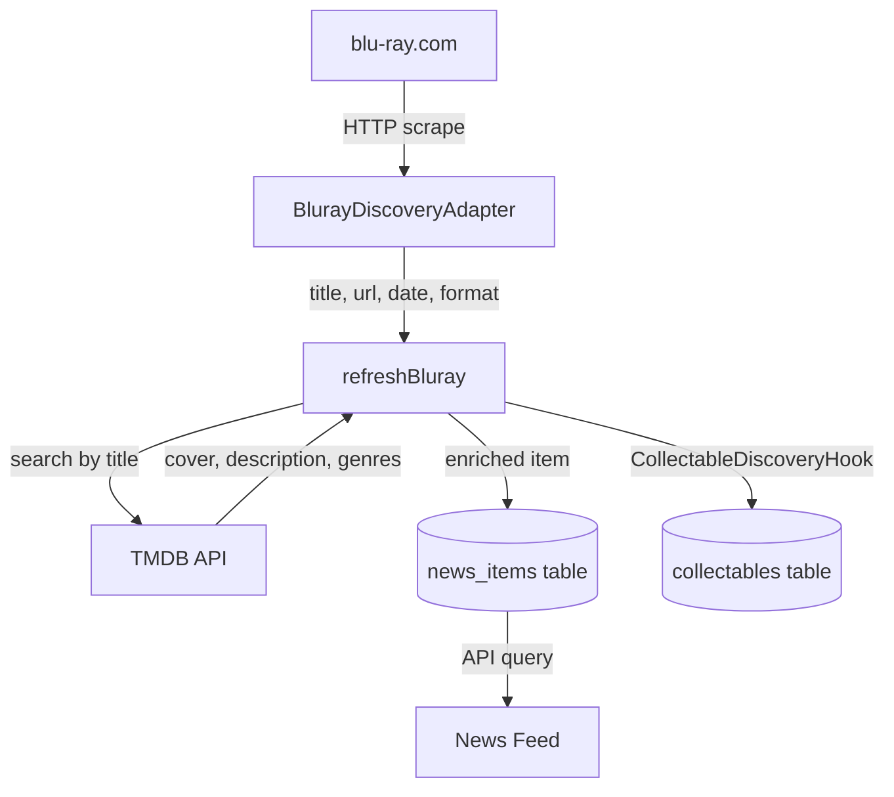

# Blu-ray.com News Source Integration

## Overview

This integration scrapes [blu-ray.com](https://www.blu-ray.com) for physical media releases (4K UHD and Blu-ray) and enriches them with TMDB metadata for display in the news feed.

## Data Flow



## Item Types

| item_type | Description |
|-----------|-------------|
| `preorder_4k` | Pre-orders for 4K UHD releases |
| `preorder_bluray` | Pre-orders for Blu-ray releases |
| `new_release_4k` | Recently released 4K UHD titles |
| `new_release_bluray` | Recently released Blu-ray titles |
| `upcoming_4k` | Upcoming 4K UHD releases |
| `upcoming_bluray` | Upcoming Blu-ray releases |

## Files

| File | Purpose |
|------|---------|
| `api/services/discovery/BlurayDiscoveryAdapter.js` | Scrapes blu-ray.com HTML |
| `api/services/discovery/CollectableDiscoveryHook.js` | Upserts enriched items to collectables |
| `api/jobs/refreshNewsCache.js` | Orchestrates fetch + TMDB enrichment |
| `api/database/migrations/20260120100000_add_physical_release_date.js` | Adds `physical_release_date` column |

## Key Fields

- `physical_release_date` — Date from blu-ray.com (when the disc ships)
- `release_date` — Theatrical release from TMDB
- `source_api` — `tmdb` when matched (falls back to `blu-ray.com` if no TMDB result)
- `source_url` — TMDB title page when matched (blu-ray.com URL stored in `payload.original_source_url`)
- `payload.tmdb_match` — Boolean indicating TMDB enrichment success

## Scraping Logic

1. Fetch `https://www.blu-ray.com` homepage
2. Parse HTML with Cheerio
3. Extract tables from 3 sections:
   - `newpreorderstabbody0` — Pre-orders
   - `newmoviestabbody0` — New releases
   - `upcomingmoviestabbody0` — Upcoming
4. Detect 4K vs Blu-ray via URL pattern (`-4K-Blu-ray`) or title
5. Extract title, date, and URL from table rows

## TMDB Enrichment

- Search by **title only** (no year filter — physical release year differs from theatrical)
- Use first result as match
- Pull: `poster_path`, `overview`, `genre_ids`, `release_date`
- ~90% match rate observed

## CollectableDiscoveryHook

When TMDB enrichment succeeds, the hook also upserts the movie to the `collectables` table:

```javascript
const hook = getCollectableDiscoveryHook();
await hook.processEnrichedItem({
  source: 'bluray',
  kind: 'movie',
  enrichment: tmdbData,
  originalItem: blurayItem
});
```

**Features:**
- Fingerprint-based deduplication (`makeCollectableFingerprint`, `makeLightweightFingerprint`)
- Format preservation (4K/Blu-ray stored in `formats[]`)
- Source attribution (blu-ray.com stored in `sources[]`)
- Disable via `COLLECTABLE_DISCOVERY_HOOK_ENABLED=false`

**Reusable for:** IGDB games, direct TMDB, and future news sources.

## Running the Job

```bash
cd api
node jobs/refreshNewsCache.js
```

Scheduled: Daily at 4am via cron

