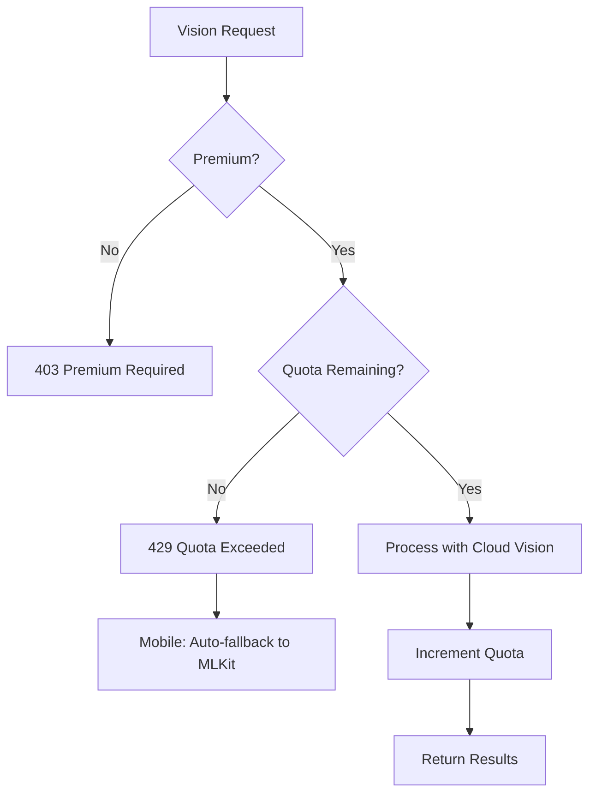
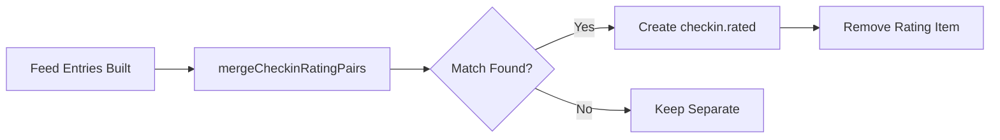
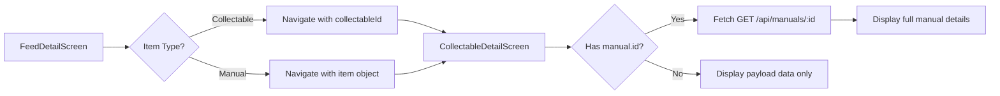
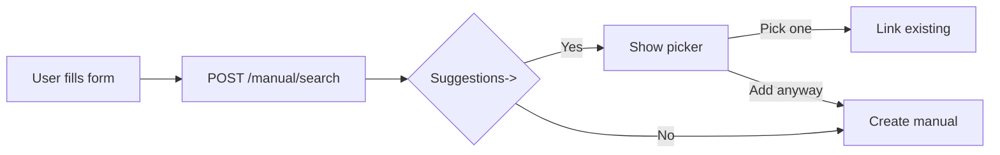
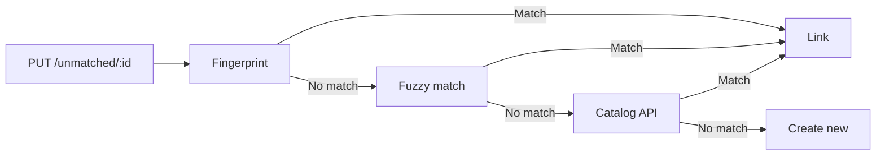
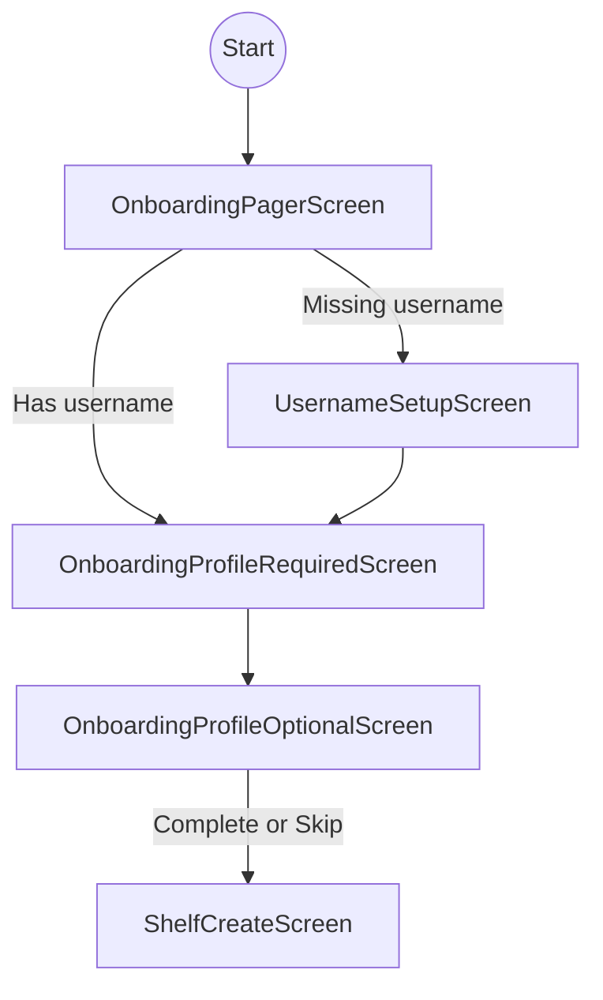
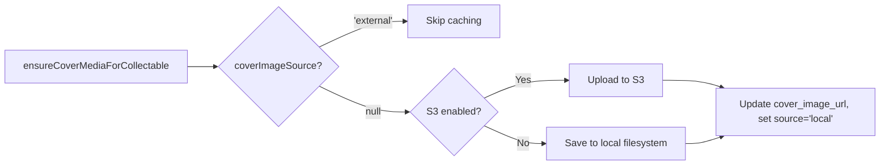
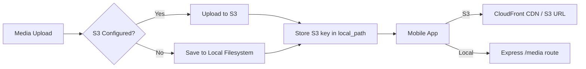

# Vision Pipeline Workflow

This document outlines the processing workflow for the shelf vision feature, which takes an image of items on a shelf and identifies/catalogs them.

## Entry Point
`VisionPipelineService.processImage(imageBase64, shelf, userId)`

Located in: [visionPipeline.js](file:///c:/Users/johna/Documents/Projects/ShelvesAI/api/services/visionPipeline.js)

---

## Workflow Steps

```mermaid
flowchart TD
    A[Step 1: Extract Items] --> B{Step 1b: Confidence Check}
    B -->|Low Confidence| C[needs_review Queue]
    B -->|High/Medium (Other)| O[Other: Manual Dedup + Save]
    B -->|High Confidence| D[Step 2: Fingerprint Lookup]
    D -->|Match Found| E[Matched Items]
    D -->|No Match| F[Step 3: Catalog Lookup]
    F -->|Resolved| G[Catalog Matches]
    F -->|Unresolved| H[Step 4: Gemini Enrichment]
    H --> I[Enriched Items]
    E --> J[Step 5: Save to Shelf]
    G --> J
    I --> J
```

### Step 1: Extract Items (Vision OCR)
- **Service**: `GoogleGeminiService.detectShelfItemsFromImage()` (or MLKit `rawItems` when OCR is disabled)
- **Input**: Base64 image (Gemini) or `rawItems` (MLKit), shelf type, optional shelf description
- **Output**: Array of detected items with title, author/primaryCreator, confidence scores (and genre/runtime when available)
- **Prompt tokens**: `visionSettings.json` supports `{shelfType}` and optional `{shelfDescription}` (description injects only when the token is present)

### Step 1b: Tiered Confidence Categorization
- **Thresholds**: `VISION_CONFIDENCE_MAX` (default: 0.92), `VISION_CONFIDENCE_MIN` (default: 0.85)
- **High confidence (>= 0.92)** -> Standard workflow (fingerprint -> catalog -> enrichment)
- **Medium confidence (0.85 - 0.92)** -> Fingerprint lookup -> manual save when unmatched
- **Low confidence (< 0.85)** -> Sent directly to `needs_review` queue

### Other Shelf (Manual-Only Path)
- **Scope**: Only when `shelf.type === "other"`
- **Flow**: Low confidence -> `needs_review`; high/medium -> manual-only save (no catalog lookup or enrichment pass)
- **Required fields**: `title` and `primaryCreator` are required to save; missing values are routed to review
- **New Fields**: Extracts `limitedEdition` (e.g. "37/50"), `itemSpecificText` (notes, inscriptions), and `genre` via Gemini
- **Deduping**: Namespace-scoped `manual_fingerprint` (`manual-other`) is used to avoid duplicate manual entries
- **Progress step**: Uses `preparingOther` progress message before save

### Step 2: Fingerprint Lookup (PostgreSQL)
- **Service**: `matchCollectable()` -> shelf-type-aware lookups
- **Lookup Order** (always):
  1. `fingerprint` column (exact hash from catalog/enrichment data)
  2. `lightweight_fingerprint` column (title + creator hash)
  3. **Shelf-type-specific secondary lookup** (see below)
- **Purpose**: Check if item already exists in local database via fast hash lookups
- **Match found** -> Item is ready for shelf (skip catalog/enrichment)
- **No match** -> Continue to Step 3

#### Shelf-Type-Specific Secondary Lookup

Different media types have different metadata visibility on spines:

| Shelf Type | Secondary Lookup | Rationale |
|------------|------------------|-----------|
| **books** | Fuzzy fingerprint (OCR hash) | Author is usually visible on spine |
| **movies** | Name search (trigram similarity) | Director is rarely visible on Blu-ray/DVD spines |
| **tv** | Name search (trigram similarity) | Creator is rarely visible on TV show spines |
| **games** | Fuzzy fingerprint (OCR hash) | Publisher is sometimes visible |

**Name Search** uses PostgreSQL `pg_trgm` trigram similarity on title only. Threshold is configurable per-type in `visionSettings.json` (default: 0.4).

**Fuzzy Fingerprint** checks the `fuzzy_fingerprints` JSONB array for raw OCR hashes stored from previous enrichments.

For detailed documentation on the matching process, see [MatchCollectable.md](MatchCollectable.md).

### Step 3: Catalog Lookup (External APIs)
- **Service**: `BookCatalogService.lookupFirstPass()` (or Game/Movie variants)
- **Routing**: When `USE_CATALOG_ROUTER=true`, uses [CatalogRouter](file:///c:/Users/johna/Documents/Projects/ShelvesAI/api/services/catalog/CatalogRouter.js) for config-driven API priority
- **Default API Order** (Books):
  1. Hardcover (if configured)
  2. OpenLibrary (fallback)
- **Purpose**: Enrich item with metadata from external catalogs
- **Toggle**: Skips when `VISION_CATALOG_ENABLED=false`
- **Resolved** -> Item is ready for shelf
- **Unresolved** -> Continue to Step 4

### Step 4: Gemini Enrichment (Conditional)
- **Service**: `GoogleGeminiService.enrichWithSchema()`
- **Condition**: Only runs if BOTH fingerprint AND catalog failed
- **Toggle**: Skips when `VISION_ENRICHMENT_ENABLED=false` (unresolved items route to `needs_review`)
- **Purpose**: Last-resort AI enrichment for unknown items
- **Fuzzy Fingerprint**: When enrichment succeeds, the raw OCR hash is stored in `fuzzy_fingerprints` array so future scans with the same "bad" spelling can match directly

### Step 5: Save to Shelf
- **Other shelf**: Uses `saveManualToShelf()` with `shelvesQueries.addManual()` and manual fingerprint dedupe.
- **Medium confidence (non-other)**: Unmatched items save as manual entries via `saveManualToShelf()`.
- **Service**: `saveToShelf()` -> `shelvesQueries.addCollectable()`
- **Actions**:
  - Upsert collectable to database
  - Persist `genre` (array) and `runtime` (minutes, when present) on collectables/manuals
  - Link collectable to user's shelf
  - Any post-enrichment low-confidence items -> `needs_review` queue

## Vision Pipeline Hooks
The vision pipeline exposes hooks at key transitions for observability and extension.
See [hooks.md](file:///c:/Users/johna/Documents/Projects/ShelvesAI/AGENTS/hooks.md) for detailed hook contexts.

### Available Hooks
| Hook | Trigger | Use Cases |
|------|---------|-----------|
| afterVisionOCR | After OCR extraction completes | Logging, metrics, pre-filtering |
| afterConfidenceCategorization | After tier split | Analytics, QA sampling |
| afterFingerprintLookup | After DB matching (per tier) | Match-rate tracking |
| afterCatalogLookup | After catalog lookup | API success metrics |
| afterGeminiEnrichment | After Gemini enrichment | Enrichment quality checks |
| beforeCollectableSave | Before collectable upsert | Validation, custom enrichment |
| beforeManualSave | Before manual entry save | Validation, custom normalization |
| afterShelfUpsert | After shelf item add | Auditing, downstream triggers |
| afterNeedsReviewQueue | After needs_review insert | Review queue monitoring |

### Registering Hooks
```javascript
const { getVisionPipelineHooks, HOOK_TYPES } = require('./visionPipelineHooks');

const hooks = getVisionPipelineHooks();
hooks.register(HOOK_TYPES.AFTER_VISION_OCR, async (ctx) => {
  console.log(`Extracted ${ctx.items.length} items`);
});
```

---

## Key Files

| File | Purpose |
|------|---------|
| [visionPipeline.js](file:///c:/Users/johna/Documents/Projects/ShelvesAI/api/services/visionPipeline.js) | Main workflow orchestration |
| [visionPipelineHooks.js](file:///c:/Users/johna/Documents/Projects/ShelvesAI/api/services/visionPipelineHooks.js) | Hook registry and execution |
| [googleGemini.js](file:///c:/Users/johna/Documents/Projects/ShelvesAI/api/services/googleGemini.js) | Vision detection + AI enrichment |
| [BookCatalogService.js](file:///c:/Users/johna/Documents/Projects/ShelvesAI/api/services/catalog/BookCatalogService.js) | Book catalog lookups |
| [CatalogRouter.js](file:///c:/Users/johna/Documents/Projects/ShelvesAI/api/services/catalog/CatalogRouter.js) | Config-driven API routing |
| [shelfType.json](file:///c:/Users/johna/Documents/Projects/ShelvesAI/api/config/shelfType.json) | Shelf type definitions + aliases |
| [shelfTypeResolver.js](file:///c:/Users/johna/Documents/Projects/ShelvesAI/api/services/config/shelfTypeResolver.js) | Shelf type resolution utility |
| [apiContainers.json](file:///c:/Users/johna/Documents/Projects/ShelvesAI/api/config/apiContainers.json) | API priority configuration |
| [visionSettings.json](file:///c:/Users/johna/Documents/Projects/ShelvesAI/api/config/visionSettings.json) | Per-type prompts, thresholds & name search config |
| [collectables.js](file:///c:/Users/johna/Documents/Projects/ShelvesAI/api/database/queries/collectables.js) | Fingerprint + fuzzy matching + name search queries |
| [MatchCollectable.md](MatchCollectable.md) | Detailed documentation of matching process |

## Configuration

### Environment Variables
| Env Variable | Default | Purpose |
|--------------|---------|------------|
| `VISION_CONFIDENCE_MAX` | `0.92` | Default high confidence threshold (fallback) |
| `VISION_CONFIDENCE_MIN` | `0.85` | Default medium confidence threshold (fallback) |
| `VISION_HOOKS_ENABLED` | `true` | Master toggle for vision hooks |
| `VISION_OCR_ENABLED` | `true` | Enable/disable Gemini Vision OCR |
| `VISION_CATALOG_ENABLED` | `true` | Enable/disable catalog API lookups |
| `VISION_ENRICHMENT_ENABLED` | `true` | Enable/disable Gemini enrichment |
| `VISION_MONTHLY_QUOTA` | `50` | Monthly cloud vision scans allowed per user |
| `USE_CATALOG_ROUTER` | `false` | Enable config-driven API routing |
| `DISABLE_HARDCOVER` | `false` | Skip Hardcover API (env override) |
| `DISABLE_OPENLIBRARY` | `false` | Skip OpenLibrary API (env override) |

### Per-Type Vision Settings

Configured in [visionSettings.json](file:///c:/Users/johna/Documents/Projects/ShelvesAI/api/config/visionSettings.json):

| Type | Max Threshold | Min Threshold | Name Search Threshold | Notes |
|------|---------------|---------------|----------------------|-------|
| `books` | 0.92 | 0.85 | N/A | Author usually visible on spine |
| `movies` | 0.80 | 0.70 | 0.4 | Director rarely on Blu-ray spines; uses title-only matching |
| `tv` | 0.80 | 0.70 | 0.4 | Creator rarely visible; uses title-only matching |
| `games` | 0.85 | 0.75 | N/A | Publisher sometimes visible |
| `vinyl` | 0.85 | 0.75 | N/A | Artist usually visible |

Each type also has a custom prompt that tells Gemini what metadata to expect (e.g., movies prompt explicitly states directors are rarely visible).
Prompts may include `{shelfDescription}` to inject the shelf description; when absent, no description is added.

The `nameSearchThreshold` is used for movies/TV where the secondary lookup uses trigram similarity on title only (instead of fuzzy fingerprints).

### Vision OCR Quota

Premium users have a monthly quota for cloud Vision (Gemini) scans. When exceeded, requests automatically fall back to on-device MLKit OCR.

#### Database Table: `user_vision_quota`

| Column | Type | Purpose |
|--------|------|---------|
| `user_id` | UUID (PK, FK) | User reference |
| `scans_used` | INTEGER | Scans consumed this period |
| `period_start` | TIMESTAMPTZ | Start of current 30-day rolling period |
| `created_at` | TIMESTAMPTZ | Row creation time |
| `updated_at` | TIMESTAMPTZ | Last update time |

#### Quota Flow



#### Period Reset Logic
- Period is 30 days rolling from `period_start`
- When `period_start` is older than 30 days, reset `scans_used=0` and `period_start=NOW()`
- Reset happens automatically on next quota check

#### API Responses

**429 Quota Exceeded:**
```json
{
  "error": "Monthly vision scan quota exceeded",
  "quotaExceeded": true,
  "quota": {
    "scansUsed": 50,
    "scansRemaining": 0,
    "daysRemaining": 12,
    "monthlyLimit": 50
  }
}
```

**Account Endpoint (GET /api/account):**
```json
{
  "user": { ... },
  "visionQuota": {
    "scansUsed": 12,
    "scansRemaining": 38,
    "monthlyLimit": 50,
    "daysRemaining": 18,
    "periodStart": "2026-01-10T00:00:00Z"
  }
}
```

#### Mobile Behavior
- Account screen shows quota info when premium is enabled
- ShelfDetailScreen handles 429 by automatically falling back to MLKit scan
- User sees alert: "Monthly Vision scan quota exceeded. Using on-device scanning instead."

#### Environment Variable
| Env Variable | Default | Purpose |
|--------------|---------|---------|
| `VISION_MONTHLY_QUOTA` | `50` | Monthly scans allowed per user |

#### Key Files
| File | Purpose |
|------|---------|
| [visionQuota.js](file:///c:/Users/johna/Documents/Projects/ShelvesAI/api/database/queries/visionQuota.js) | Quota queries (getQuota, incrementUsage) |
| [accountController.js](file:///c:/Users/johna/Documents/Projects/ShelvesAI/api/controllers/accountController.js) | Returns quota in account response |
| [shelvesController.js](file:///c:/Users/johna/Documents/Projects/ShelvesAI/api/controllers/shelvesController.js) | Quota check + increment in processShelfVision |
| [AccountScreen.js](file:///c:/Users/johna/Documents/Projects/ShelvesAI/mobile/src/screens/AccountScreen.js) | Displays quota info |
| [ShelfDetailScreen.js](file:///c:/Users/johna/Documents/Projects/ShelvesAI/mobile/src/screens/ShelfDetailScreen.js) | Handles 429 with MLKit fallback |

### Shelf Type Configuration

Shelf types are defined in [shelfType.json](file:///c:/Users/johna/Documents/Projects/ShelvesAI/api/config/shelfType.json). Each type uses **plural as canonical** (e.g., `books`, `movies`, `games`):

```json
{
  "types": {
    "books": {
      "canonical": "books",
      "aliases": ["book", "novel", "novels", "comic", "manga"],
      "apiContainerKey": "books",
      "catalogService": "BookCatalogService"
    }
  }
}
```

**Adding a new shelf type:**
1. Add entry to `shelfType.json` with canonical name, aliases, and API container key
2. Create catalog service in `api/services/catalog/` if API lookups are needed
3. Add prompts/thresholds to `visionSettings.json` for OCR behavior

---

## Config-Driven API Routing

When `USE_CATALOG_ROUTER=true`, catalog lookups use [apiContainers.json](file:///c:/Users/johna/Documents/Projects/ShelvesAI/api/config/apiContainers.json) to determine API priority:

```json
{
  "books": {
    "mode": "fallback",
    "apis": [
      { "name": "hardcover", "enabled": true, "priority": 1, "envDisableKey": "DISABLE_HARDCOVER" },
      { "name": "openLibrary", "enabled": true, "priority": 2, "envDisableKey": "DISABLE_OPENLIBRARY" }
    ]
  }
}
```

**Modes:**
- `fallback` - Stop on first successful result
- `merge` - Call all APIs in parallel, combine results

**Adding New APIs:**
1. Create adapter in `api/services/catalog/adapters/`
2. Register in [CatalogRouter.js](file:///c:/Users/johna/Documents/Projects/ShelvesAI/api/services/catalog/CatalogRouter.js)
3. Add to container config in [apiContainers.json](file:///c:/Users/johna/Documents/Projects/ShelvesAI/api/config/apiContainers.json)

---

## Activity Feed Aggregation + Social

This project now batches item-level feed events into time-window aggregates and exposes likes/comments on those aggregates.

### Overview
- **Item events** still write to `event_logs`.
- **Aggregates** live in `event_aggregates` and are keyed by `(user_id, shelf_id, event_type)` with a fixed window.
- **Social metadata** (likes, comments) references aggregates, not individual events.

### Aggregation Workflow
1. `logEvent()` selects or creates an **open aggregate** for the user/shelf/type.
2. The new event is inserted into `event_logs` with `aggregate_id`.
3. The aggregate updates:
   - `item_count`
   - `last_activity_at`
   - `preview_payloads` (capped)

**Window logic:**
- Window starts at first event time and closes after `FEED_AGGREGATE_WINDOW_MINUTES`.
- New events within the window attach to the same aggregate.
- Events outside the window create a new aggregate.

### Feed Read Path
- `/api/feed` reads from `event_aggregates` (not `event_logs`).
- `preview_payloads` drive the feed card preview list.
- Social counts and `hasLiked` are attached per aggregate.
- `/api/feed/:id` accepts **aggregate IDs** and returns all events in that aggregate (with title resolution from DB when payloads are missing).

### Social Endpoints
- `POST /api/feed/:eventId/like`
- `POST /api/feed/:eventId/comments`
- `GET /api/feed/:eventId/comments`
- `DELETE /api/feed/:eventId/comments/:commentId`

### Client Behavior
- Feed list hides `shelf.created` entries (client-side).
- Friends/Discover exclude the viewer's own events, while All includes them.
- `readOnly` shelves hide edit/add actions in the UI.

### Combined Check-in + Rating Events

When a user checks in AND rates the same item within 30 minutes, the feed controller merges these into a single `checkin.rated` event:



**Matching criteria:**
- Same user
- Same item (collectableId, manualId, or title)
- Within configurable time window (default: 30 minutes via `CHECKIN_RATING_MERGE_WINDOW_MINUTES`)

**Display:** Combined card shows check-in badge + rating stars in both header and item preview.

### Manual Items in Feed

Manual items (user-created entries not in the global catalog) are fully supported in the feed system:

**Rating Events for Manual Items:**
- Rating a manual item logs an `item.rated` event with `manualId` in the payload
- Feed displays manual items with their cover images (via `coverMediaUrl`)
- Tapping a manual item in FeedDetailScreen navigates to CollectableDetailScreen

**Feed Detail → CollectableDetail Flow:**


**Owner Rating Display:**
- When viewing a manual item from another user's feed, the screen fetches:
  - Your rating: `GET /api/ratings/:manualId?type=manual`
  - Owner's rating: `GET /api/ratings/:manualId/user/:ownerId?type=manual`
- Both ratings display in the detail screen's rating section

### Key Files
| File | Purpose |
|------|---------|
| [feed.js](file:///c:/Users/johna/Documents/Projects/ShelvesAI/api/database/queries/feed.js) | Aggregate lookup + event logging |
| [eventSocial.js](file:///c:/Users/johna/Documents/Projects/ShelvesAI/api/database/queries/eventSocial.js) | Likes/comments queries |
| [feedController.js](file:///c:/Users/johna/Documents/Projects/ShelvesAI/api/controllers/feedController.js) | Feed list + aggregate detail + checkin/rating merge |
| [eventSocialController.js](file:///c:/Users/johna/Documents/Projects/ShelvesAI/api/controllers/eventSocialController.js) | Social endpoints |
| [SocialFeedScreen.js](file:///c:/Users/johna/Documents/Projects/ShelvesAI/mobile/src/screens/SocialFeedScreen.js) | Feed list UI + filtering + checkin.rated cards |
| [FeedDetailScreen.js](file:///c:/Users/johna/Documents/Projects/ShelvesAI/mobile/src/screens/FeedDetailScreen.js) | Aggregate detail + likes/comments + checkin.rated view |
| [CollectableDetailScreen.js](file:///c:/Users/johna/Documents/Projects/ShelvesAI/mobile/src/screens/CollectableDetailScreen.js) | Item detail + manual fetching + owner ratings |
| [manuals.js](file:///c:/Users/johna/Documents/Projects/ShelvesAI/api/routes/manuals.js) | Manual item detail endpoint |

### Backfill Scripts
- `node api/scripts/backfill-event-aggregates.js`
- `node api/scripts/backfill-event-payloads.js`

### Feed Config
| Env Variable | Default | Purpose |
|--------------|---------|------------|
| `FEED_AGGREGATE_WINDOW_MINUTES` | `15` | Time window for aggregates |
| `FEED_AGGREGATE_PREVIEW_LIMIT` | `5` | Preview payload cap per aggregate |
| `CHECKIN_RATING_MERGE_WINDOW_MINUTES` | `30` | Time window for merging check-in + rating pairs |

---

## Manual Add & Needs Review Deduplication

Manual add and needs_review flows use a centralized [CollectableMatchingService](file:///c:/Users/johna/Documents/Projects/ShelvesAI/api/services/collectableMatchingService.js) for catalog-backed shelves. `other` shelves use manual fingerprint dedupe instead of catalog/API matching.

### Manual Add (2-Step Flow)



**Endpoint:** `POST /api/shelves/:shelfId/manual/search`

Searches database and external APIs, returns suggestions for user to choose from.

### Needs Review Completion



**Matching order:**
1. Lightweight fingerprint (exact hash)
2. Fuzzy match (pg_trgm similarity)
3. Catalog API lookup
4. Create new collectable

**Other shelf override:**
- Only fingerprint match links to collectable.
- If no fingerprint match, create (or reuse) a manual entry using `manual_fingerprint`.
- No fuzzy match, no catalog API lookup, no new collectable creation for `other`.

### Key Files

| File | Purpose |
|------|---------|
| [collectableMatchingService.js](file:///c:/Users/johna/Documents/Projects/ShelvesAI/api/services/collectableMatchingService.js) | Centralized fingerprint + API matching |
| [shelvesController.js](file:///c:/Users/johna/Documents/Projects/ShelvesAI/api/controllers/shelvesController.js) | `searchManualEntry` for /manual/search |
| [unmatched.js](file:///c:/Users/johna/Documents/Projects/ShelvesAI/api/routes/unmatched.js) | PUT /:id with API fallback |

---

## Onboarding Workflow

New users are required to complete onboarding before accessing the main app. The flow enforces required fields (email, first name, city, state) and allows optional bio/photo with a skip option.

### Flow Overview



### Required Fields
- **Email**
- **First name**
- **City**
- **State**

### Optional Fields
- **Bio**
- **Profile photo**

### API Endpoints
- `POST /api/auth/register` (requires email)
- `PUT /api/profile` (updates email, name, city/state, bio)
- `POST /api/profile/photo` (optional photo upload)
- `POST /api/onboarding/complete` (marks onboarding complete after required fields)

### Key Files
| File | Purpose |
|------|---------|
| [OnboardingPagerScreen.js](file:///c:/Users/johna/Documents/Projects/ShelvesAI/mobile/src/screens/OnboardingPagerScreen.js) | Intro swipe flow (fun product page first) |
| [OnboardingProfileRequiredScreen.js](file:///c:/Users/johna/Documents/Projects/ShelvesAI/mobile/src/screens/OnboardingProfileRequiredScreen.js) | Required profile fields |
| [OnboardingProfileOptionalScreen.js](file:///c:/Users/johna/Documents/Projects/ShelvesAI/mobile/src/screens/OnboardingProfileOptionalScreen.js) | Optional bio + photo, skip allowed |
| [UsernameSetupScreen.js](file:///c:/Users/johna/Documents/Projects/ShelvesAI/mobile/src/screens/UsernameSetupScreen.js) | Username setup when missing |
| [onboardingController.js](file:///c:/Users/johna/Documents/Projects/ShelvesAI/api/controllers/onboardingController.js) | Onboarding completion gate |
| [onboardingScreen.json](file:///c:/Users/johna/Documents/Projects/ShelvesAI/api/config/onboardingScreen.json) | Onboarding copy configuration (served via `/api/config/onboarding`) |

---

## API Compliance: Cover Art & Attribution

To comply with API Terms of Service, cover art and attribution are handled per-provider. The system uses a **provider-agnostic design** where all logic is in backend adapters, and the mobile UI simply renders what's in the database.

### Database Fields (collectables table)

| Column | Type | Purpose |
|--------|------|---------|
| `cover_image_url` | TEXT | Resolved URL or local path for cover |
| `cover_image_source` | TEXT | `'external'` (hot-linked) or `'local'` (cached) |
| `attribution` | JSONB | Provider-specific attribution data |

### Provider Policies

| Provider | Cover Policy | Attribution Required |
|----------|-------------|---------------------|
| **OpenLibrary** | `'external'` - Must hot-link from `covers.openlibrary.org` | Courtesy link to book page |
| **TMDB** | `null` -> cached locally | Logo + disclaimer + link |
| **Hardcover** | `null` -> cached locally | None |

### Attribution JSONB Structure

```json
{
  "linkUrl": "https://provider.com/item/123",
  "linkText": "View on Provider",
  "logoKey": "tmdb",
  "disclaimerText": "Required disclaimer text here"
}
```

- `logoKey` maps to bundled SVG in mobile app (e.g., `tmdb` -> `tmdb-logo.svg`)
- Mobile renders what's present; no provider-specific conditionals

### Caching Logic (media.js)



### Key Files

| File | Purpose |
|------|---------|
| [openLibrary.js](file:///c:/Users/johna/Documents/Projects/ShelvesAI/api/services/openLibrary.js) | Sets `coverImageSource: 'external'`, attribution link |
| [tmdb.adapter.js](file:///c:/Users/johna/Documents/Projects/ShelvesAI/api/adapters/tmdb.adapter.js) | Sets `coverImageSource: null`, logo + disclaimer |
| [hardcover.adapter.js](file:///c:/Users/johna/Documents/Projects/ShelvesAI/api/adapters/hardcover.adapter.js) | Sets `coverImageSource: null`, no attribution |
| [media.js](file:///c:/Users/johna/Documents/Projects/ShelvesAI/api/database/queries/media.js) | `ensureCoverMediaForCollectable` respects source, uploads to S3 or local |
| [s3.js](file:///c:/Users/johna/Documents/Projects/ShelvesAI/api/services/s3.js) | S3 client service for media uploads |
| [collectables.js](file:///c:/Users/johna/Documents/Projects/ShelvesAI/api/database/queries/collectables.js) | `upsert` includes cover + attribution fields |
| [visionPipeline.js](file:///c:/Users/johna/Documents/Projects/ShelvesAI/api/services/visionPipeline.js) | `saveToShelf` passes cover/attribution to upsert |
| [CollectableDetailScreen.js](file:///c:/Users/johna/Documents/Projects/ShelvesAI/mobile/src/screens/CollectableDetailScreen.js) | Renders attribution (logo, link, disclaimer) |

### Adding a New Provider

1. Create adapter in `api/adapters/` or `api/services/catalog/adapters/`
2. Set `coverImageUrl`, `coverImageSource`, and `attribution` in adapter output
3. If logo required:
   - Add SVG to `mobile/src/assets/`
   - Import in `CollectableDetailScreen.js`
   - Add `logoKey` condition in `renderAttribution()`

---

## Media Storage (S3 Integration)

ShelvesAI supports AWS S3 for media storage, enabling horizontal scaling and CDN integration.

### Storage Architecture



### Configuration

| Env Variable | Required | Description |
|--------------|----------|-------------|
| `AWS_REGION` | Yes (for S3) | AWS region (default: `us-east-1`) |
| `AWS_ACCESS_KEY_ID` | Yes (for S3) | AWS IAM access key |
| `AWS_SECRET_ACCESS_KEY` | Yes (for S3) | AWS IAM secret key |
| `S3_BUCKET_NAME` | Yes (for S3) | S3 bucket name |
| `S3_PUBLIC_URL` | Recommended | CloudFront CDN URL or S3 public URL |

**Feature Toggle:** S3 is enabled only when `AWS_ACCESS_KEY_ID`, `AWS_SECRET_ACCESS_KEY`, and `S3_BUCKET_NAME` are all set. Otherwise, local filesystem is used.

### S3 Bucket Structure

```
shelvesai-media/
├── books/{title}/{checksum}.jpg
├── movies/{title}/{checksum}.jpg
├── games/{title}/{checksum}.jpg
├── albums/{title}/{checksum}.jpg
└── profiles/{userId}/{checksum}.jpg
```

### URL Resolution

The `local_path` column stores the same path structure regardless of storage backend:
- **S3 mode:** Full URL = `${S3_PUBLIC_URL}/${local_path}`
- **Local mode:** Full URL = `${API_BASE}/media/${local_path}`

### CloudFront Integration

For production, use CloudFront CDN in front of S3:
1. Keep S3 bucket **private** (no public access)
2. Configure CloudFront with Origin Access Control (OAC)
3. Set `S3_PUBLIC_URL` to CloudFront distribution URL

**Benefits:** Better security, lower latency, DDoS protection, reduced S3 costs.

### Migration Script

Migrate existing local files to S3:

```bash
# Dry run first
node api/scripts/migrate-media-to-s3.js --dry-run

# Run migration
node api/scripts/migrate-media-to-s3.js

# Options:
#   --dry-run       Show what would be migrated
#   --batch=N       Process N files at a time (default: 10)
#   --table=NAME    'media', 'profile_media', or 'all'
#   --skip=N        Skip first N records (for resuming)
```

### Media URL Resolution

The API uses a centralized media URL resolver to generate proper URLs for profile pictures and cover images. This handles the difference between local development (Express static files) and production (S3/CloudFront).

**Resolution Logic:**

```mermaid
flowchart TD
    A[resolveMediaUrl] --> B{S3 Enabled?}
    B -->|Yes| C{S3_PUBLIC_URL set?}
    C -->|Yes| D[Return: https://{S3_PUBLIC_URL}/{path}]
    C -->|No| E[Return: https://{bucket}.s3.{region}.amazonaws.com/{path}]
    B -->|No| F[Return: /media/{path}]
```

**Protocol Handling:** The resolver automatically adds `https://` if the `S3_PUBLIC_URL` is missing the protocol prefix.

**API Response Fields:**

| Path Field | URL Field | Description |
|------------|-----------|-------------|
| `profileMediaPath` | `profileMediaUrl` | User profile pictures |
| `coverMediaPath` | `coverMediaUrl` | Collectable cover images |
| `collectableCoverMediaPath` | `collectableCoverMediaUrl` | Cover images in feed context |

The API returns **both** the raw path and the resolved URL. Mobile clients should prefer the URL field when available, falling back to path-based construction for backwards compatibility.

**Mobile Usage:**
```javascript
// Prefer pre-resolved URL, fallback to path construction
const avatarUrl = user.profileMediaUrl
  || (user.profileMediaPath && `${apiBase}/media/${user.profileMediaPath}`)
  || user.picture;
```

### Key Files

| File | Purpose |
|------|---------|
| [s3.js](file:///c:/Users/johna/Documents/Projects/ShelvesAI/api/services/s3.js) | S3 client: `uploadBuffer`, `getPublicUrl`, `deleteObject`, `isEnabled` |
| [mediaUrl.js](file:///c:/Users/johna/Documents/Projects/ShelvesAI/api/services/mediaUrl.js) | URL resolver: `resolveMediaUrl`, `addMediaUrls`, `isUsingS3` |
| [media.js](file:///c:/Users/johna/Documents/Projects/ShelvesAI/api/database/queries/media.js) | Cover caching with S3/local fallback |
| [profileMedia.js](file:///c:/Users/johna/Documents/Projects/ShelvesAI/api/database/queries/profileMedia.js) | Profile photo uploads with S3/local fallback |
| [migrate-media-to-s3.js](file:///c:/Users/johna/Documents/Projects/ShelvesAI/api/scripts/migrate-media-to-s3.js) | Migration script for existing files |

