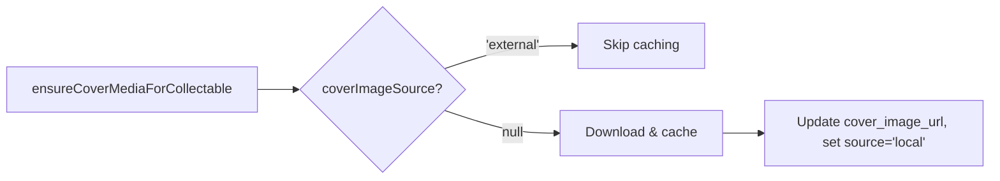

# Vision Pipeline Workflow

This document outlines the processing workflow for the shelf vision feature, which takes an image of items on a shelf and identifies/catalogs them.

## Entry Point
`VisionPipelineService.processImage(imageBase64, shelf, userId)`

Located in: [visionPipeline.js](file:///c:/Users/johna/Documents/Projects/ShelvesAI/api/services/visionPipeline.js)

---

## Workflow Steps

```mermaid
flowchart TD
    A[Step 1: Extract Items] --> B{Step 1b: Confidence Check}
    B -->|Low Confidence| C[needs_review Queue]
    B -->|High/Medium (Other)| O[Other: Manual Dedup + Save]
    B -->|High Confidence| D[Step 2: Fingerprint Lookup]
    D -->|Match Found| E[Matched Items]
    D -->|No Match| F[Step 3: Catalog Lookup]
    F -->|Resolved| G[Catalog Matches]
    F -->|Unresolved| H[Step 4: Gemini Enrichment]
    H --> I[Enriched Items]
    E --> J[Step 5: Save to Shelf]
    G --> J
    I --> J
```

### Step 1: Extract Items (Gemini Vision)
- **Service**: `GoogleGeminiService.detectShelfItemsFromImage()`
- **Input**: Base64 image, shelf type, optional shelf description
- **Output**: Array of detected items with title, author/primaryCreator, confidence scores
- **Prompt tokens**: `visionSettings.json` supports `{shelfType}` and optional `{shelfDescription}` (description injects only when the token is present)

### Step 1b: Tiered Confidence Categorization
- **Thresholds**: `VISION_CONFIDENCE_MAX` (default: 0.92), `VISION_CONFIDENCE_MIN` (default: 0.85)
- **High confidence (≥ 0.92)** → Standard workflow (fingerprint → catalog → enrichment)
- **Medium confidence (0.85 - 0.92)** → Fingerprint lookup only → special "uncertain" enrichment (skips catalog APIs)
- **Low confidence (< 0.85)** → Sent directly to `needs_review` queue

### Other Shelf (Manual-Only Path)
- **Scope**: Only when `shelf.type === "other"`
- **Flow**: Low confidence -> `needs_review`; high/medium -> manual-only save (no catalog lookup or enrichment pass)
- **Required fields**: `title` and `primaryCreator` are required to save; missing values are routed to review
- **Deduping**: Namespace-scoped `manual_fingerprint` (`manual-other`) is used to avoid duplicate manual entries
- **Progress step**: Uses `preparingOther` progress message before save

### Step 2: Fingerprint Lookup (PostgreSQL)
- **Service**: `matchCollectable()` → hash-based lookups only
- **Lookup Order**:
  1. `fingerprint` column (exact hash from catalog/enrichment data)
  2. `lightweight_fingerprint` column (title + creator hash)
  3. `fuzzy_fingerprints` array (raw OCR hashes from previous enrichments)
- **Purpose**: Check if item already exists in local database via fast hash lookups
- **Match found** → Item is ready for shelf (skip catalog/enrichment)
- **No match** → Continue to Step 3

### Step 3: Catalog Lookup (External APIs)
- **Service**: `BookCatalogService.lookupFirstPass()` (or Game/Movie variants)
- **Routing**: When `USE_CATALOG_ROUTER=true`, uses [CatalogRouter](file:///c:/Users/johna/Documents/Projects/ShelvesAI/api/services/catalog/CatalogRouter.js) for config-driven API priority
- **Default API Order** (Books):
  1. Hardcover (if configured)
  2. OpenLibrary (fallback)
- **Purpose**: Enrich item with metadata from external catalogs
- **Resolved** → Item is ready for shelf
- **Unresolved** → Continue to Step 4

### Step 4: Gemini Enrichment (Conditional)
- **Service**: `GoogleGeminiService.enrichWithSchema()`
- **Condition**: Only runs if BOTH fingerprint AND catalog failed
- **Purpose**: Last-resort AI enrichment for unknown items
- **Fuzzy Fingerprint**: When enrichment succeeds, the raw OCR hash is stored in `fuzzy_fingerprints` array so future scans with the same "bad" spelling can match directly

### Step 5: Save to Shelf
- **Other shelf**: Uses `saveManualToShelf()` with `shelvesQueries.addManual()` and manual fingerprint dedupe.
- **Service**: `saveToShelf()` → `shelvesQueries.addCollectable()`
- **Actions**:
  - Upsert collectable to database
  - Link collectable to user's shelf
  - Any post-enrichment low-confidence items → `needs_review` queue

---

## Key Files

| File | Purpose |
|------|---------|
| [visionPipeline.js](file:///c:/Users/johna/Documents/Projects/ShelvesAI/api/services/visionPipeline.js) | Main workflow orchestration |
| [googleGemini.js](file:///c:/Users/johna/Documents/Projects/ShelvesAI/api/services/googleGemini.js) | Vision detection + AI enrichment |
| [BookCatalogService.js](file:///c:/Users/johna/Documents/Projects/ShelvesAI/api/services/catalog/BookCatalogService.js) | Book catalog lookups |
| [CatalogRouter.js](file:///c:/Users/johna/Documents/Projects/ShelvesAI/api/services/catalog/CatalogRouter.js) | Config-driven API routing |
| [apiContainers.json](file:///c:/Users/johna/Documents/Projects/ShelvesAI/api/config/apiContainers.json) | API priority configuration |
| [visionSettings.json](file:///c:/Users/johna/Documents/Projects/ShelvesAI/api/config/visionSettings.json) | Per-type prompts & confidence thresholds |
| [collectables.js](file:///c:/Users/johna/Documents/Projects/ShelvesAI/api/database/queries/collectables.js) | Fingerprint + fuzzy matching queries |

## Configuration

### Environment Variables
| Env Variable | Default | Purpose |
|--------------|---------|------------|
| `VISION_CONFIDENCE_MAX` | `0.92` | Default high confidence threshold (fallback) |
| `VISION_CONFIDENCE_MIN` | `0.85` | Default medium confidence threshold (fallback) |
| `USE_CATALOG_ROUTER` | `false` | Enable config-driven API routing |
| `DISABLE_HARDCOVER` | `false` | Skip Hardcover API (env override) |
| `DISABLE_OPENLIBRARY` | `false` | Skip OpenLibrary API (env override) |

### Per-Type Vision Settings

Configured in [visionSettings.json](file:///c:/Users/johna/Documents/Projects/ShelvesAI/api/config/visionSettings.json):

| Type | Max Threshold | Min Threshold | Notes |
|------|---------------|---------------|-------|
| `book` | 0.92 | 0.85 | Standard - author usually visible on spine |
| `movie` | 0.80 | 0.70 | Lower - director rarely on Blu-ray spines |
| `game` | 0.85 | 0.75 | Lower - publisher sometimes visible |
| `vinyl` | 0.85 | 0.75 | Standard - artist usually visible |

Each type also has a custom prompt that tells Gemini what metadata to expect (e.g., movies prompt explicitly states directors are rarely visible).
Prompts may include `{shelfDescription}` to inject the shelf description; when absent, no description is added.

---

## Config-Driven API Routing

When `USE_CATALOG_ROUTER=true`, catalog lookups use [apiContainers.json](file:///c:/Users/johna/Documents/Projects/ShelvesAI/api/config/apiContainers.json) to determine API priority:

```json
{
  "books": {
    "mode": "fallback",
    "apis": [
      { "name": "hardcover", "enabled": true, "priority": 1, "envDisableKey": "DISABLE_HARDCOVER" },
      { "name": "openLibrary", "enabled": true, "priority": 2, "envDisableKey": "DISABLE_OPENLIBRARY" }
    ]
  }
}
```

**Modes:**
- `fallback` - Stop on first successful result
- `merge` - Call all APIs in parallel, combine results

**Adding New APIs:**
1. Create adapter in `api/services/catalog/adapters/`
2. Register in [CatalogRouter.js](file:///c:/Users/johna/Documents/Projects/ShelvesAI/api/services/catalog/CatalogRouter.js)
3. Add to container config in [apiContainers.json](file:///c:/Users/johna/Documents/Projects/ShelvesAI/api/config/apiContainers.json)

---

## Activity Feed Aggregation + Social

This project now batches item-level feed events into time-window aggregates and exposes likes/comments on those aggregates.

### Overview
- **Item events** still write to `event_logs`.
- **Aggregates** live in `event_aggregates` and are keyed by `(user_id, shelf_id, event_type)` with a fixed window.
- **Social metadata** (likes, comments) references aggregates, not individual events.

### Aggregation Workflow
1. `logEvent()` selects or creates an **open aggregate** for the user/shelf/type.
2. The new event is inserted into `event_logs` with `aggregate_id`.
3. The aggregate updates:
   - `item_count`
   - `last_activity_at`
   - `preview_payloads` (capped)

**Window logic:**
- Window starts at first event time and closes after `FEED_AGGREGATE_WINDOW_MINUTES`.
- New events within the window attach to the same aggregate.
- Events outside the window create a new aggregate.

### Feed Read Path
- `/api/feed` reads from `event_aggregates` (not `event_logs`).
- `preview_payloads` drive the feed card preview list.
- Social counts and `hasLiked` are attached per aggregate.
- `/api/feed/:id` accepts **aggregate IDs** and returns all events in that aggregate (with title resolution from DB when payloads are missing).

### Social Endpoints
- `POST /api/feed/:eventId/like`
- `POST /api/feed/:eventId/comments`
- `GET /api/feed/:eventId/comments`
- `DELETE /api/feed/:eventId/comments/:commentId`

### Client Behavior
- Feed list hides `shelf.created` entries (client-side).
- Friends/Discover exclude the viewer's own events, while All includes them.
- `readOnly` shelves hide edit/add actions in the UI.

### Key Files
| File | Purpose |
|------|---------|
| [feed.js](file:///c:/Users/johna/Documents/Projects/ShelvesAI/api/database/queries/feed.js) | Aggregate lookup + event logging |
| [eventSocial.js](file:///c:/Users/johna/Documents/Projects/ShelvesAI/api/database/queries/eventSocial.js) | Likes/comments queries |
| [feedController.js](file:///c:/Users/johna/Documents/Projects/ShelvesAI/api/controllers/feedController.js) | Feed list + aggregate detail |
| [eventSocialController.js](file:///c:/Users/johna/Documents/Projects/ShelvesAI/api/controllers/eventSocialController.js) | Social endpoints |
| [SocialFeedScreen.js](file:///c:/Users/johna/Documents/Projects/ShelvesAI/mobile/src/screens/SocialFeedScreen.js) | Feed list UI + filtering |
| [FeedDetailScreen.js](file:///c:/Users/johna/Documents/Projects/ShelvesAI/mobile/src/screens/FeedDetailScreen.js) | Aggregate detail + likes/comments |

### Backfill Scripts
- `node api/scripts/backfill-event-aggregates.js`
- `node api/scripts/backfill-event-payloads.js`

### Feed Config
| Env Variable | Default | Purpose |
|--------------|---------|------------|
| `FEED_AGGREGATE_WINDOW_MINUTES` | `15` | Time window for aggregates |
| `FEED_AGGREGATE_PREVIEW_LIMIT` | `5` | Preview payload cap per aggregate |

---

## Manual Add & Needs Review Deduplication

Manual add and needs_review flows use a centralized [CollectableMatchingService](file:///c:/Users/johna/Documents/Projects/ShelvesAI/api/services/collectableMatchingService.js) for catalog-backed shelves. `other` shelves use manual fingerprint dedupe instead of catalog/API matching.

### Manual Add (2-Step Flow)


**Endpoint:** `POST /api/shelves/:shelfId/manual/search`

Searches database and external APIs, returns suggestions for user to choose from.

### Needs Review Completion


**Matching order:**
1. Lightweight fingerprint (exact hash)
2. Fuzzy match (pg_trgm similarity)
3. Catalog API lookup
4. Create new collectable

**Other shelf override:**
- Only fingerprint match links to collectable.
- If no fingerprint match, create (or reuse) a manual entry using `manual_fingerprint`.
- No fuzzy match, no catalog API lookup, no new collectable creation for `other`.

### Key Files

| File | Purpose |
|------|---------|
| [collectableMatchingService.js](file:///c:/Users/johna/Documents/Projects/ShelvesAI/api/services/collectableMatchingService.js) | Centralized fingerprint + API matching |
| [shelvesController.js](file:///c:/Users/johna/Documents/Projects/ShelvesAI/api/controllers/shelvesController.js) | `searchManualEntry` for /manual/search |
| [unmatched.js](file:///c:/Users/johna/Documents/Projects/ShelvesAI/api/routes/unmatched.js) | PUT /:id with API fallback |

---

## Onboarding Workflow

New users are required to complete onboarding before accessing the main app. The flow enforces required fields (email, first name, city, state) and allows optional bio/photo with a skip option.

### Flow Overview


### Required Fields
- **Email**
- **First name**
- **City**
- **State**

### Optional Fields
- **Bio**
- **Profile photo**

### API Endpoints
- `POST /api/auth/register` (requires email)
- `PUT /api/profile` (updates email, name, city/state, bio)
- `POST /api/profile/photo` (optional photo upload)
- `POST /api/onboarding/complete` (marks onboarding complete after required fields)

### Key Files
| File | Purpose |
|------|---------|
| [OnboardingPagerScreen.js](file:///c:/Users/johna/Documents/Projects/ShelvesAI/mobile/src/screens/OnboardingPagerScreen.js) | Intro swipe flow (fun product page first) |
| [OnboardingProfileRequiredScreen.js](file:///c:/Users/johna/Documents/Projects/ShelvesAI/mobile/src/screens/OnboardingProfileRequiredScreen.js) | Required profile fields |
| [OnboardingProfileOptionalScreen.js](file:///c:/Users/johna/Documents/Projects/ShelvesAI/mobile/src/screens/OnboardingProfileOptionalScreen.js) | Optional bio + photo, skip allowed |
| [UsernameSetupScreen.js](file:///c:/Users/johna/Documents/Projects/ShelvesAI/mobile/src/screens/UsernameSetupScreen.js) | Username setup when missing |
| [onboardingController.js](file:///c:/Users/johna/Documents/Projects/ShelvesAI/api/controllers/onboardingController.js) | Onboarding completion gate |
| [onboardingScreen.json](file:///c:/Users/johna/Documents/Projects/ShelvesAI/api/config/onboardingScreen.json) | Onboarding copy configuration (served via `/api/config/onboarding`) |

---

## API Compliance: Cover Art & Attribution

To comply with API Terms of Service, cover art and attribution are handled per-provider. The system uses a **provider-agnostic design** where all logic is in backend adapters, and the mobile UI simply renders what's in the database.

### Database Fields (collectables table)

| Column | Type | Purpose |
|--------|------|---------|
| `cover_image_url` | TEXT | Resolved URL or local path for cover |
| `cover_image_source` | TEXT | `'external'` (hot-linked) or `'local'` (cached) |
| `attribution` | JSONB | Provider-specific attribution data |

### Provider Policies

| Provider | Cover Policy | Attribution Required |
|----------|-------------|---------------------|
| **OpenLibrary** | `'external'` - Must hot-link from `covers.openlibrary.org` | Courtesy link to book page |
| **TMDB** | `null` → cached locally | Logo + disclaimer + link |
| **Hardcover** | `null` → cached locally | None |

### Attribution JSONB Structure

```json
{
  "linkUrl": "https://provider.com/item/123",
  "linkText": "View on Provider",
  "logoKey": "tmdb",
  "disclaimerText": "Required disclaimer text here"
}
```

- `logoKey` maps to bundled SVG in mobile app (e.g., `tmdb` → `tmdb-logo.svg`)
- Mobile renders what's present; no provider-specific conditionals

### Caching Logic (media.js)



### Key Files

| File | Purpose |
|------|---------|
| [openLibrary.js](file:///c:/Users/johna/Documents/Projects/ShelvesAI/api/services/openLibrary.js) | Sets `coverImageSource: 'external'`, attribution link |
| [tmdb.adapter.js](file:///c:/Users/johna/Documents/Projects/ShelvesAI/api/adapters/tmdb.adapter.js) | Sets `coverImageSource: null`, logo + disclaimer |
| [hardcover.adapter.js](file:///c:/Users/johna/Documents/Projects/ShelvesAI/api/adapters/hardcover.adapter.js) | Sets `coverImageSource: null`, no attribution |
| [media.js](file:///c:/Users/johna/Documents/Projects/ShelvesAI/api/database/queries/media.js) | `ensureCoverMediaForCollectable` respects source |
| [collectables.js](file:///c:/Users/johna/Documents/Projects/ShelvesAI/api/database/queries/collectables.js) | `upsert` includes cover + attribution fields |
| [visionPipeline.js](file:///c:/Users/johna/Documents/Projects/ShelvesAI/api/services/visionPipeline.js) | `saveToShelf` passes cover/attribution to upsert |
| [CollectableDetailScreen.js](file:///c:/Users/johna/Documents/Projects/ShelvesAI/mobile/src/screens/CollectableDetailScreen.js) | Renders attribution (logo, link, disclaimer) |

### Adding a New Provider

1. Create adapter in `api/adapters/` or `api/services/catalog/adapters/`
2. Set `coverImageUrl`, `coverImageSource`, and `attribution` in adapter output
3. If logo required:
   - Add SVG to `mobile/src/assets/`
   - Import in `CollectableDetailScreen.js`
   - Add `logoKey` condition in `renderAttribution()`

